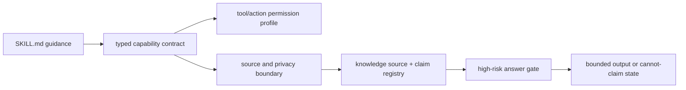

# Agent Skill Capability Contracts

Role: current contract.

Status: architecture contract plus public-safe internal manifest prototype for
GitHub #518.

Typed capability contracts are execution boundaries for agent skills. They say
what a skill-like path may read, write, route through tools, expose to external
models, and claim after source checks. They are not a second fact layer, not a
replacement for `SKILL.md`, and not a public SDK schema.

The machine-readable public-safe example lives at
`tests/fixtures/knowledge_sources/public_safe_capability_manifest.json`. The
runtime validator lives in
`skills/aippocampus/scripts/aippocampus_runtime/knowledge/capability_types.py`.

## Decision

AIppocampus will model high-risk or composable skill behavior as typed
capability records when a plain runtime instruction is too weak to test:

- `SKILL.md` remains the human and agent bootstrap guidance layer.
- Capability manifests describe execution permissions, source boundaries,
  privacy partitions, side effects, and evaluation protocols.
- Clean source, governed knowledge-source manifests, promoted claims, and
  answer gates remain the proof layers.
- Capability text never becomes factual support for a user-facing claim.

This keeps the project from flattening every skill into prose while avoiding a
new attribution, ranking, or strategy-fact layer.

## Skill Type Taxonomy

The initial taxonomy is deliberately broad enough for future agent skills while
remaining small enough to validate:

| Skill type | Meaning | Typical evaluation pressure |
| --- | --- | --- |
| `declarative_knowledge` | Uses stored source, registry, or knowledge records. | Source reopen, freshness, claim lifecycle, conflict checks. |
| `procedural_operation` | Performs a workflow or command sequence. | Dry-run support, reversibility, audit events, permission profile. |
| `perceptual_parsing` | Parses documents, screenshots, transcripts, or source windows. | Source-ref preservation, schema validation, malformed-output handling. |
| `judgment_gating` | Decides whether to proceed, ask, degrade, or refuse. | Cannot-claim boundaries, negative fixtures, abstention behavior. |
| `interactive_communication` | Produces questions, user-visible wording, or handoff text. | Missing-context questions, redaction, no unsupported advice. |
| `learning_adaptation` | Updates future routing, preference, or strategy candidates. | Append-only staging, source support, no direct formal memory write. |
| `metacognitive` | Inspects confidence, uncertainty, route state, or task state. | Clear uncertainty labels, stale-handle detection, source-required status. |
| `social_relational` | Handles relationship, affect, trust, or continuity behavior. | Sensitivity partitioning, anti-overpersonalization, user confirmation. |
| `tool_affordance` | Exposes a tool/action capability to an agent host. | Host permission profile, side-effect level, rollback/audit contract. |

These are capability labels, not identities. One capability may carry several
types when it parses, gates, communicates, and uses tools in one bounded path.

## Minimum Record Shape

A typed capability record should declare:

- identity and review metadata:
  `schema_version`, `capability_id`, `version`, `owner`, `supersession`,
  `last_reviewed_at`
- scope:
  `risk_level`, `domain`, `skill_types`, `runtime_layer`, `intent_scope`
- input/output contracts:
  `input_schema`, `output_schema`, `output_classes`
- source and memory boundaries:
  `memory_policy`, `source_requirements`, allowed/forbidden source types,
  source reopen, freshness, jurisdiction, effective-date, conflict scan, and
  human-review requirements
- privacy and external-tool boundaries:
  `privacy_policy`, partitions, redaction policy, cross-partition behavior, and
  external source-text transfer policy
- tool/action boundaries:
  `tool_permissions`, side-effect level, reversibility, dry-run, rollback, and
  audit events
- evaluation:
  `evaluation_protocols`, negative fixtures, sanitized report requirements, and
  cannot-claim boundaries

The public-safe manifest fixture exercises this shape with two records for the
same tool id, `knowledge.claim_lookup`:

- a low-risk navigation profile that may return candidate route handles but
  cannot emit high-risk answers;
- a high-risk contract-review risk-flag profile that requires source reopen,
  active claims, current lifecycle, privacy partition checks, and the high-risk
  answer gate.

## Runtime Relationship

Capability contracts sit between skill guidance and the proof gates:

The contract can stop unsafe execution before expensive work happens. It can
also select the correct permission profile for the same tool under different
risk levels. It cannot make a claim true, override a source registry, bypass
source reopen, or certify answer quality.

## Conflict Resolution

When multiple typed capabilities apply to the same turn, the resolver lives in
`aippocampus_runtime.knowledge.capability_conflicts`. It is a deterministic
activation/action policy, not a planner, judge, or fact layer. It accepts
already-proposed action packets from capability manifests, answer gates,
privacy guards, task routes, tool policies, or communication preferences, then
chooses the highest-precedence action and explains which lower-priority actions
were suppressed.

The first policy uses this precedence:

1. `privacy_boundary`
2. `safety_high_risk`
3. `source_truth`
4. `task_domain`
5. `operation_side_effect`
6. `communication_style`

This order keeps helpfulness and tone below privacy, consent, high-risk safety,
source reopen, freshness, and conflict-set gates. A warm support style cannot
override a crisis boundary. A direct legal/medical-like answer cannot override
a missing-context or human-review gate. An external payload, unsafe tool
side-effect, secret-like, property-risk, or governed-profile route cannot
override a concrete privacy partition. Ordinary same-user cross-domain
continuity should normally project as a local route handle, not as a
`cannot_proceed` privacy refusal. A task operation cannot proceed past stale or
conflicting source truth. Brevity or personality preferences cannot remove
required uncertainty, source citation, or cannot-claim boundaries.

The resolver emits sanitized reports with:

- the selected action id, capability id, precedence class, and output state;
- suppressed action ids and reason codes such as
  `source_truth_overrides_operation_side_effect`;
- missing-context questions from the selected gate when the safe output state is
  `missing_context_question`;
- cannot-claim markers, including
  `capability_text_is_not_fact_source` and
  `conflict_resolution_is_activation_policy_not_truth`.

Unknown prose fields, source text, prompt text, and model-written rationales are
not consumed as authority. Capability conflict resolution governs activation
and action selection only; it cannot promote strategy text, style guidance,
Dream residue, model retrospection, or capability prose into truth. Source
truth still belongs to clean source, governed registries, claim lifecycle, and
answer gates.

## Relation To Existing Layers

Source-backed memory:
clean source and source refs remain the evidence authority. Capability
manifests may name `clean_source`, `registry`, `sidecar`, or `working_memory`
as read surfaces, but generated summaries, scent, and sidecars remain
navigation until source is reopened.

Knowledge-source registry:
governed knowledge-source manifests decide whether source material is eligible.
Knowledge-claim records decide assertion-level promotion. Capability manifests
only decide whether a skill path is allowed to request or use those claims.

High-risk answer gates:
capability manifests may require `high_risk_answer_gate`, but they do not
replace it. The gate still owns source reopen, applicability, lifecycle,
conflict, privacy, and cannot-claim output states.

Policy and safety:
privacy partitions, external-tool redaction, source-text export policy, and
human-review requirements belong in the capability record because they affect
whether a host action may run. Secret redaction and private source handling
still use the existing runtime safety helpers.

Tool/action surfaces:
the same tool may have multiple permission profiles. A low-risk route can
return candidates, while a high-risk route requires stricter evidence and may
still end at `human_review_required`. Host-specific support varies across
Codex hooks, MCP, CLI, and other agent runtimes, so manifests describe surface
capability instead of assuming every host can run the same hooks or writes.

## Evaluation Guidance

Map skill types to evidence protocols instead of averaging them into one score:

| Skill type family | Protocol examples |
| --- | --- |
| Knowledge and answer support | Source reopen fixtures, lifecycle/freshness checks, answer-gate negatives. |
| Procedural and tool affordance | Dry-run tests, permission-profile tests, side-effect and rollback checks. |
| Parsing and communication | Schema validation, malformed-output fixtures, missing-context question tests. |
| Learning and metacognition | Append-only staging tests, stale-handle tests, no-formal-write assertions. |
| Social and relational behavior | Privacy partition fixtures, anti-overpersonalization controls, user-confirmation gates. |

The current #518 smoke is deterministic and public-safe. It proves manifest
shape, low/high permission separation for one tool, routing-only evidence
rejection, stale/superseded rejection, concrete privacy blocking, local route
handle projection for ordinary same-user continuity, and sanitized reports. It
does not prove live model quality, legal quality, private-history coverage, or
public API stability.

The multimodal provider-routing contract in
`docs/architecture/multimodal-provider-routing.md` reuses this typed capability
vocabulary for provider routes. It adds route-level modality, execution
location, media-origin allowance, and privacy decisions without promoting typed
capability manifests into a public SDK or answer authority.

## Non-Goals

- Do not migrate every `SKILL.md` into a manifest.
- Do not treat contract prose as source truth.
- Do not implement medical, legal, therapy, financial, or compliance advice.
- Do not create a second strategy-fact, attribution, ranking, or scoring layer.
- Do not require low-risk utilities to adopt the full high-risk contract shape.
- Do not publish a public Python or TypeScript SDK schema from this prototype.

## Verification

Current deterministic coverage lives in
`tests/aippocampus/test_knowledge_capability_manifest.py`:

- manifest sections and taxonomy validation;
- low/high permission profiles for the same tool id;
- high-risk routing-only evidence cannot emit an answer;
- stale or superseded claims require human review;
- private/cross-partition external routes are blocked;
- smoke output excludes raw input text, source text, claim text, and local
  absolute paths.

`tests/aippocampus/test_knowledge_capability_conflicts.py` covers the #571
composition policy:

- communication style vs crisis/safety gate;
- legal-like high-risk answer gate vs direct answer;
- concrete external/secret/side-effect privacy block vs local same-user route handle;
- stale/source-conflict gate vs task operation;
- brevity/style preference vs required uncertainty and source reopen.
