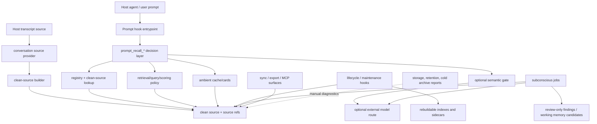

# Runtime Script Map

This is the maintainer navigation map for `skills/aippocampus/scripts/`. It is
not a generated call graph and should not mirror every module docstring. Keep it
focused on ownership, invocation routes, dependencies, and public/internal
status for high-risk scripts and public entrypoints.

When adding a new public entrypoint, hook path, sync path, MCP surface,
registry/retrieval component, warm ambient component, or subconscious job
component, update this map and the cheap guard in
`tools/aippocampus/docs/check_docs_health.py`.

For the exact inventory of remaining Codex-specific raw-rollout/default-home
call sites, see `docs/architecture/provider-entrypoint-inventory.md`.

## High-Level Runtime Flow

This graph is the contributor-facing dependency map. It shows ownership and
call direction at the layer level; it is not a generated import graph.

Core recall is the `Hook -> Decision -> Registry/Retrieval/Semantic/Ambient`
path. Maintenance and storage tools may inspect the same generated artifacts,
but they must not become foreground recall dependencies. If a future deployment
split moves storage, retention, or cold archive work into another process, the
core recall path should still be able to run from registry, clean source, and
its rebuildable lookup sidecars.

## Status Legend

- Public entrypoint: documented or user-facing CLI / hook / MCP command.
- Runtime internal: shipped with the installable skill but called through a
  public entrypoint or scheduler.
- Repo maintenance: shipped script used for diagnostics, storage accounting, or
  operator workflows; not a stable user API.
- Rebuildable cache: may write generated indexes or sidecars, never canonical
  source truth.

## Repo Import Boundary

The installable runtime is still script-first: public and internal runtime code
lives under `skills/aippocampus/scripts/` and must keep direct script invocation
working after the skill is copied into Codex home.

Runtime helpers may move under `skills/aippocampus/scripts/aippocampus_runtime/`
when a narrow ownership boundary is clear. Keep the old top-level script/import
name as a thin compatibility shim until the public stability boundary says it
can be removed.

The executable shim inventory is generated by
`python tools/aippocampus/docs/compat_shim_inventory.py --json`. Treat
`keep_cli`, `temporary_compat`, `delete_now`, and `legacy_bridge` buckets as the
current cleanup contract for #305; see
`docs/architecture/compatibility-shim-inventory.md` for the short maintainer
snapshot. Do not infer permanence from a shim existing today.

No `legacy_bridge` exceptions should remain. Credential-adjacent and
model-output-heavy commands now have package owners plus thin top-level
compatibility shims. Do not reintroduce a single-implementation top-level
script to dodge ownership questions. For semantic/subconscious judgment, keep
meaningful work in package owners, model/subconscious sidecars, and source-ref
validation; static cue lists are only bootstrap hints, not a substitute for
semantic adjudication.

Current package pilots:

| Package | Top-level compatibility shims | Owner boundary |
|---|---|---|
| `aippocampus_runtime/artifacts/` | `artifact_publish.py`, `export_bundle.py`, `import_bundle.py` | Generated artifact leases, SQLite publish, last-known-good pointer helpers, and portable bundle export/import APIs shared by build/search/sync paths. |
| `aippocampus_runtime/cli/` | `aippocampus_cli.py` | Public `aippocampus` command facade and child-script dispatch policy. |
| `aippocampus_runtime/core.py` | `aippocampuslib.py` | Shared runtime helpers for raw-source compatibility re-exports, file hashing, and generated artifact path defaults. Provider-neutral registry storage defaults live in `aippocampus_runtime/registry/paths.py` and are re-exported here only for import compatibility. Text compaction, redaction/credential transport guards, CLI error payloads, and thread-anchor graph helpers live in direct owner modules and are re-exported here only for import compatibility. |
| `aippocampus_runtime/{text,safety,anchor_graph}.py` and `aippocampus_runtime/cli/errors.py` | none | Direct owners for compact text helpers, external-model redaction/HTTP credential transport/cache metric helpers, thread-anchor parsing/graph construction, and CLI error payload shaping. These are package APIs, not subprocess-backed facades. |
| `aippocampus_runtime/health.py` | `aippocampus_health.py` | Runtime readiness, registry artifact health, optional question stats, and maintenance-action rendering shared by CLI, MCP, and frozen binaries without subprocess script dispatch. |
| `aippocampus_runtime/privacy.py` | none | Public-safe projection helpers that redact local paths from registry/MCP payloads without changing private source truth. |
| `aippocampus_runtime/coding/` | `coding_rejected_route_probes.py`, `coding_ticket_host_contract.py` | Dream retrospective fixture adapter for source-backed rejected coding routes, plus host consumption contract and simulator for source-backed coding-continuity tickets. |
| `aippocampus_runtime/dream/` | `dream_input_pack.py`, `dream_one_sidedness.py`, `dream_precision_policy.py`, `dream_queue.py`, `dream_retrospective_lifecycle.py`, `dream_sleep_cycle.py`, `dream_worker.py` | Hook-safe dream delivery policy, source-backed dream input packs, deterministic one-sidedness gating, deterministic dream-hypothesis precision policies, detached queue planning, retrospective lifecycle checks for parked future-facing probes, detached sleep-cycle queue execution, bounded model-backed dream workers, stable bounded-worker prompt contract, and background-adjudicated working-memory projection. |
| `aippocampus_runtime/journey/` | `journey_tracking.py` | Source-backed Journey Tracking dataclasses, conservative instantiation gate, append-only waypoint updates, dormancy/expiry transitions, feedback actions, and replay fixture smoke. |
| `aippocampus_runtime/knowledge/` | none | Deterministic knowledge-source manifest, claim-promotion, append-only update-lifecycle validation, high-risk answer-gate policy, and internal typed capability-manifest validation for public-safe fixtures. It separates source eligibility, assertion-level promotion, source reopen, review/signature, conflict, supersession/retraction, rollback pointers, typed execution permissions, and answer-time cannot-claim boundaries without becoming a retrieval, ranking, public SDK, or answer-generation layer. |
| `aippocampus_runtime/mcp/` | `aippocampus_mcp_server.py` | Read-mostly MCP server implementation for agent clients, with privacy projection, registry/search, sync helpers, and latest-reply lookup imported through package owners rather than flat scripts. |
| `aippocampus_runtime/ops/` | `storage_capacity_report.py`, `rollout_size_audit.py`, `retention_report.py`, `cold_archive.py`, `provider_doctor.py`, `recall_funnel_smoke.py`, `recall_navigation_comparison.py`, `recall_navigation_comparison_fixtures.py`, `storage_governance.py`, `storage_eviction.py`, `activation_authority_audit.py` | Operator-facing storage, retention, raw-rollout, live-provider visibility, progressive recall funnel, deterministic recall-navigation arm comparison and its public-safe fixture owner, storage-governance, storage-eviction apply helpers, and activation-surface authority diagnostics; outside foreground recall. `activation_authority_audit.py` also owns the #483 no-write foreground-usefulness metrics and append-only lifecycle apply manifest for strategy-like activation rows. |
| `aippocampus_runtime/question/` | `question_confirmation.py`, `question_health.py`, `question_tracking.py` | Borderline confirmation artifact helpers, derived question lifecycle health stats, and deterministic question-link tracking remain direct compatibility shims; feedback pressure, source-ref resolution, and optional local vector-index hinting are package-owner helpers. |
| `aippocampus_runtime/recall/` | `active_recall.py`, `active_recall_lock.py`, `ambient_recall_cards.py`, `ambient_recall_policy.py`, `ambient_thread_cache.py`, `fresh_thread_activation.py`, `fresh_thread_action.py`, `fresh_thread_demo.py`, `fresh_thread_demo_fixtures.py`, `fresh_thread_scent.py`, `prompt_context_render.py`, `prompt_recall_decision.py`, `retrieval.py`, `retrieval_query_policy.py`, `retrieval_score_fusion.py`, `semantic_recall_gate.py`, `semantic_trigger_router.py` | Foreground recall decisions, prompt-hook rendering/budgets/context/evidence, final source-evidence skip/scent/evidence projection, named skip/scent/evidence gate policy, context-aware scent-threshold diagnostics, semantic gate/result-cache/cue-cache/trigger routing, life/profile cue policy, active recall and short-lived route locks, ambient cards/cache/policy, fresh-thread scent packet projection, progressive activation state, agent-owned fresh-thread action policy, public-safe fresh-thread demo orchestration, public-safe fixture catalog, query policy, retrieval execution, named retrieval scoring policy, and score fusion. Cue, budget, core, evidence, policy/projection/threshold, and semantic-cache helpers are package-owner modules rather than flat import promises. |
| `aippocampus_runtime/reflection/` | `reflection_space.py` | Inspectable Journey/Waypoint/current-frontier topology, source-ref-carried feedback adjustments for reflection/AAR strategy, correction reconsolidation adjudication, and the #484 AAR v2 deterministic action-time nudge/report surface without mutating clean source or Journey history. |
| `aippocampus_runtime/source/` | `build_clean_source.py`, `build_semantic_scope_labels.py`, `latest_reply.py`, `multimodal_manifest.py`, `search_clean_source.py`, `semantic_scope_labels.py` | Clean-source corpus building, latest assistant reply lookup for raw audit fallback, direct clean-source search, multimodal source-manifest and media-origin policy validation, package-owner rollout behavior-event extraction, dynamic semantic scope-label sidecar validation/merge, semantic sidecar materialization, and portable registry member path repair. |
| `aippocampus_runtime/subconscious/` | `memory_candidate_router.py`, `question_resolution.py`, `subconscious_agent.py`, `subconscious_deterministic_jobs.py`, `subconscious_job_circuits.py`, `subconscious_jobs.py`, `subconscious_jobs_config.py`, `subconscious_question_diagnostics.py`, `subconscious_runtime.py`, `subconscious_scheduler.py`, `subconscious_worker.py`, `theme_emergence.py` | Candidate routing and hook-safe foreground stripping, minimal read-only tool-loop agent runner, deterministic follow-up dispatch, deterministic question-resolution/theme-emergence runners, job circuit/schema contracts, package-only sample-wave planning, package-only append-only job-finding storage, package-only finding validation, model/deterministic job runner orchestration, run configuration/default-path helpers, question-extraction diagnostics, shared read-only runtime primitives, hook-safe detached scheduler, package-owner shared tool/final loop helpers, package-only validation diagnostics, and single-shot consolidation worker helpers used by subconscious job runners. |
| `aippocampus_runtime/sync/` | `sync_bundle.py`, `sync_contract.py` | Local-folder sync bundle command plus shared manifest, transport metadata, and privacy boundary helpers reused by sync routes. |
| `aippocampus_runtime/sync/encrypted/` | `encrypted_sync_bundle.py`, `encrypted_sync_keys.py`, `encrypted_sync_migration.py` | Age-backed encrypted bundle, key, migration, package-only crypto, and package-owner object-storage helpers. |
| `aippocampus_runtime/sync/object_storage/` | `sync_object_storage.py`, `object_storage_client.py` | Object-storage sync command, client construction, and package-only provider signing helpers. |
| `aippocampus_runtime/warm_ambient/` | `ambient_warm_scheduler.py`, `warm_ambient_recall.py` | Warm-recall CLI edge and detached warm-job scheduling remain direct compatibility shims; prompt rendering, scout taxonomy, and source-ref validation are package-owner helpers. |

Repo-owned docs, smoke, and benchmark tools may import runtime helpers through
`tools/aippocampus/repo_paths.py`. The local `_paths.py` files in docs, smoke,
and benchmark folders are compatibility wrappers around that single helper, not
new public APIs. New repo maintenance tools should reuse that helper instead of
adding fresh ad hoc `sys.path` insertion rules.

## Protocol-First Ports

AIppocampus uses Protocol-first ports selectively; this is not a tagless-final architecture.
Introduce a `Protocol` only when a runtime boundary has real replacement pressure:
multiple host providers, optional local versus external
implementations, test doubles that need the same contract, or backend adapters
whose behavior must be swapped without changing source-backed payloads.

Do not introduce a port for pure helper functions, one-off call sites, package
cleanup, or code that is already clearer as direct source-backed transformation.
The default shape is still ordinary typed functions plus dataclasses/typed dicts
for durable payloads. A useful port must make a concrete swap safer; it must not
create a second schema owner, dependency-injection framework, or abstraction
layer whose only proof is that future code might need it.

When a port is justified:

- Keep the `Protocol` tiny and behavior-focused.
- Keep source ids/source refs in the payload contract, not hidden in adapter
  state.
- Provide a deterministic local or test implementation when useful.
- Preserve compatibility shims only for existing public commands/imports.
- Add tests that swap the implementation and prove source-backed evidence keys
  survive the boundary.

Current pilots:

- `ConversationProvider` is the ingestion port for Codex, Claude Code, generic
  JSONL, and future host transcript sources. Clean-source tests include a
  deterministic provider double and assert that `source_ref`, `source_id`,
  message ids, and turn links survive the swap.
- `QuestionVectorIndex` is an advisory vector-neighbor port. Its local
  implementation returns stable `source_id` values and a truth-boundary marker;
  vector scores remain navigation hints until clean source is reopened.

## Repo Smoke And Readiness Tools

| Tool or group | Purpose | Invocation route | Key dependencies | Status |
|---|---|---|---|---|
| `tools/aippocampus/smoke/smoke_codex_long_session_continuity.py` | Slow/live real Codex app-server long-session smoke for synthetic correction survival across host compaction, plus clean-source rebuild verification; optional `--progress-jsonl` writes append-only sanitized phase rows for manual diagnostics. | Manual public-readiness command; not part of the fast deterministic tier. | Codex app-server, `build_clean_source.py`, existing real-host smoke client. | Repo maintenance |
| `tools/aippocampus/smoke/smoke_claude_code_history.py` | Privacy-preserving local Claude Code history parser smoke that reports counts and booleans only. | Manual provider-readiness command; not part of the fast deterministic tier. | `conversation_sources/claude_code.py`; local Claude Code `projects/**/*.jsonl` store. | Repo maintenance |
| `tools/aippocampus/smoke/smoke_cross_agent_continuity.py` | Deterministic synthetic Codex/Claude source-backed retrieval smoke through registry clean source and MCP `search_memory`. | Manual provider-readiness command and fast reviewed sensitive test coverage. | Codex/Claude providers, registry, MCP search. | Repo maintenance |
| `tools/aippocampus/smoke/smoke_source_evidence_recall_eval.py` | Sanitized selected source-evidence recall smoke. Default mode requires semantic sidecar-labeled life-wide clean-source turns; `--allow-deterministic-labels` is only a deterministic label/search wiring fallback and cannot prove semantic-sidecar sample coverage. | Manual source-evidence readiness command and fast deterministic tests. | Registry clean source, project timeline, semantic scope-label sidecars, dynamic source ranking. | Repo maintenance |
| `tools/aippocampus/smoke/smoke_question_confirmation_live.py` | Sanitized no-write smoke for optional live question-pair confirmation and tracking round trip. | Manual #134 calibration smoke; dry-run unless `--call-model` is passed. | `aippocampus_runtime/question/{tracking,confirmation_live}.py`, temporary JSONL artifacts only. | Repo maintenance |

## Public Entrypoints And Install Flow

| Script or group | Purpose | Invocation route | Key dependencies | Status |
|---|---|---|---|---|
| `aippocampus_runtime/cli/facade.py` and `aippocampus_cli.py` compatibility shim | Composable `aippocampus` command facade over packaged entrypoint mains. | Console script / operator CLI; old direct script path remains available. | In-process command resolution via `CommandInvocation`; `run_command(..., capture_output=True)` returns a `CommandResult` for Python callers while preserving child JSON and exit codes. The portable `export` / `import` bundle commands resolve to package owners rather than script subprocesses. | Public entrypoint |
| `aippocampus_runtime/health.py` and `aippocampus_health.py` compatibility shim | Runtime readiness, public smoke checks, and optional derived question stats. | CLI, install docs, CI-adjacent smoke, MCP `memory_health`, active recall, registry registration, and frozen binaries. | `HealthOptions`, `build_health_report()`, and `health_report()` are the package API; CLI parsing/rendering stays at the edge. Core checks depend on `aippocampus_runtime/core.py`, `aippocampus_runtime/registry/store.py`, and filesystem/env state. Optional question stats are lazy-loaded so basic health does not pull the question/registry/subconscious graph at import time. | Public entrypoint |
| `aippocampus_runtime/ops/maintenance.py` plus `aippocampus_maintenance.py` compatibility shim | Compact maintenance wrapper for routine operator checks. | CLI/manual maintenance. | Health, registry, docs/smoke conventions. | Repo maintenance |
| `aippocampus_runtime/onboarding/{facade,codex,frontier,status}.py` plus `onboard.py`, `onboard_codex.py`, `onboard_frontier.py`, and `onboard_status.py` compatibility shims | Build or report source-backed onboarding state. `facade.py` is the provider-aware facade; `codex.py` remains the Codex/default provider runner; `frontier.py` owns the optional external-model frontier boundary. | CLI and install/readiness workflows. | Clean source, registry, project timeline, optional external model env. | Public entrypoint |
| `aippocampus_runtime/artifacts/{export_bundle,import_bundle,checkpoint}.py` plus `export_bundle.py` / `import_bundle.py` / `checkpoint.py` compatibility shims | Move or checkpoint clean-source memory bundles. | `aippocampus export`, `aippocampus import`, and direct script compatibility paths for manual export/import/checkpoint. | Registry paths, clean-source manifests, privacy boundaries, package index-builder API. | Public entrypoint |
| `aippocampus_runtime/source/{anchors,latest_reply,locate_rollout}.py` plus `append_anchor.py` / `latest_reply.py` / `locate_rollout.py` compatibility shims | Raw rollout audit and recovery helpers. | CLI/debug paths only. | Raw rollout files, thread anchors, and packaged source helpers. | Repo maintenance |

## Conversation Source Providers

Conversation providers are the ingestion boundary between host-agent transcript
storage and AIppocampus clean source. They may know about Codex, Claude Code, or
future hosts, but clean source, registry rows, retrieval, sync, MCP, semantic
sidecars, and subconscious jobs should consume provider-normalized source
identity rather than host-specific storage layouts.

Provider modules must not decide where AIppocampus stores generated artifacts.
Registry storage remains owned by `aippocampus_runtime/registry/store.py` and
`aippocampus_registry_dir()`: `AIPPOCAMPUS_REGISTRY_DIR` and the legacy
`CODEX_HOME/aippocampus-registry` path are storage compatibility concerns, not
conversation-provider homes.

| Script or group | Purpose | Invocation route | Key dependencies | Status |
|---|---|---|---|---|
| `conversation_sources/base.py` | Shared `ConversationProvider`, `ConversationSourceRef`, and provider-normalized visible message shapes. | Imported by registry/onboarding/source builders. | Standard library typing/dataclasses only. | Runtime internal |
| `conversation_sources/codex.py` | Codex Desktop provider for live `sessions/` and `archived_sessions/` rollout JSONL discovery, current-cwd lookup, metadata extraction, and thread identity. | Legacy wrappers in `aippocampus_runtime/core.py`, registry scan, current-thread registration. | Codex rollout JSONL first-line `session_meta`; no registry writes. | Runtime internal |
| `conversation_sources/claude_code.py` | Claude Code provider for local `projects/**/*.jsonl` transcript discovery, current-cwd lookup, public metadata extraction, provider-prefixed thread identity, and visible-message clean-source parsing. | `onboard.py --provider claude-code`, registry scan, provider smoke tests. | Claude Code JSONL top-level `sessionId` / `cwd` / `timestamp`; filters thinking/tool payloads from daily clean source. | Runtime internal |
| `conversation_sources/generic_jsonl.py` | Validated generic JSONL import provider for non-Codex/non-Claude hosts. | `onboard.py --provider generic-jsonl`, explicit import/smoke paths. | `AIPPOCAMPUS_GENERIC_IMPORT_DIR` or explicit provider path; rejects ambiguous roles/turns. | Runtime internal |

Claude Code support has a clean-source parser for visible text and explicit
registration. Host MCP setup remains a separate integration surface documented
in `docs/guides/claude-code-mcp.md`. The repository also ships a minimal
project skill at `.claude/skills/aippocampus/SKILL.md` that points Claude Code
at the existing MCP/CLI surfaces; Claude Code hooks and configuration-mutating
installers are not claimed by the provider contract.

## Hook Paths

Codex-only hook installer boundary: the current hook handlers, installers, and
diagnostics target Codex hook events and Codex `hooks.json`. Conversation
provider support for `claude-code` or `generic-jsonl` does not imply host hook
installation support for those providers.

| Script or group | Purpose | Invocation route | Key dependencies | Status |
|---|---|---|---|---|
| `aippocampus_runtime/hooks/prompt.py` plus `aippocampus_prompt_hook.py` compatibility shim | Foreground prompt hook that emits skip/scent/evidence under a strict budget. | Opt-in Codex `UserPromptSubmit` hook; direct script path remains stable for Codex hook configs. | Packaged prompt recall modules, Dream delivery boundary, registry/search modules. | Public entrypoint |
| `aippocampus_runtime/hooks/lifecycle.py` plus `aippocampus_lifecycle_hook.py` compatibility shim | Lifecycle hook for deterministic maintenance around Codex session events. | Opt-in Codex lifecycle hook; direct script path remains stable for Codex hook configs. | Clean source, registry, maintenance helpers. | Public entrypoint |
| `aippocampus_runtime/hooks/install_prompt.py`, `aippocampus_runtime/hooks/install_lifecycle.py`, and `aippocampus_runtime/hooks/diagnose.py` plus `install_aippocampus_prompt_hook.py` / `install_aippocampus_lifecycle_hook.py` / `diagnose_hooks.py` compatibility shims | Install and diagnose Codex hook wiring. | CLI/install docs for Codex host integration only. | Codex config paths, hook command validation, and `host_integration` JSON metadata. | Public entrypoint |
| `aippocampus_runtime/recall/prompt_*`, `aippocampus_runtime/recall/semantic_*`, and remaining top-level compatibility shims (`prompt_context_render.py`, `prompt_recall_decision.py`, `semantic_recall_gate.py`, `semantic_trigger_router.py`) | Prompt recall cue policy, life-wide/profile cue catalogs, named skip/scent/evidence gate policy, final source-evidence projection, context-aware scent-threshold diagnostics, ambient cards/cache/policy, budget, rendering, query policy, source-evidence assembly, optional semantic gate/result-cache/cue-cache, and trigger routing. Deleted cue/budget/core/evidence/cache helper shims now resolve through package owners only. | Called by prompt hook, active recall, scheduler, and smokes. | Registry/search, timeline, semantic cue cache, model route metadata. | Runtime internal |

## Registry, Retrieval, And Indexing

| Script or group | Purpose | Invocation route | Key dependencies | Status |
|---|---|---|---|---|
| `aippocampus_runtime/registry/{api,store,search,provider}.py`, `registry.py`, and `registry_store.py` / `registry_search.py` compatibility shims | Resolve registry paths, register/scan thread rows, search registry metadata, and build provider-aware thread keys. | Most runtime entrypoints; `registry.py` remains the public CLI/import compatibility shim over `api.py`. | Global registry layout and privacy policy. | Runtime internal |
| `aippocampus_runtime/source/{behavior_events,clean_source,latest_reply,registry_paths,rollout,search,semantic_scope_builder,semantic_scope_labels,turns}.py`, `build_clean_source.py` / `build_semantic_scope_labels.py` / `latest_reply.py` / `search_clean_source.py` / `semantic_scope_labels.py` compatibility shims | Convert provider-normalized transcript messages into source-backed clean messages/turns, parse Codex rollout envelopes for compatible audit/index consumers, find the latest assistant reply for raw-audit fallback, search clean-source JSONL directly, validate/merge semantic scope-label sidecars, materialize sidecars from source-backed findings, repair portable registry member paths, and emit structured rollout behavior events. | Onboarding, import, MCP/search surfaces, maintenance, tests. | Provider parsers, raw transcript audit, scope-label policy, clean-source JSONL, semantic sidecars, tool/test event hashing. | Public entrypoint |
| `aippocampus_runtime/recall/{retrieval,query_policy,scoring_policy,score_fusion,rollout_search}.py`, `retrieval.py` / `retrieval_query_policy.py` / `retrieval_score_fusion.py` / `search_rollout.py` compatibility shims | Source-backed retrieval, named scoring policies, explicit score-fusion behavior, and raw audit fallback. | Prompt hook, MCP, CLI search surfaces, active recall, segmented retrieval, future vector/graph fusion consumers. | Clean-source JSONL, registry rows, query policy, stable source ids/source refs; scores remain ranking hints only. `scoring_policy.py` owns retrieval/segment/active-recall ranking weights; `prompt_recall_policy.py` owns foreground skip/scent/evidence thresholds and source-evidence quality boosts; neither module should replace semantic/subconscious judgement with static cue wordlists. | Runtime internal |
| `aippocampus_runtime/recall/{index_builder,segment_builder,segment_search}.py` plus `build_index.py`, `build_segments.py`, and `search_segments.py` compatibility shims, and `aippocampus_runtime/artifacts/publish.py` plus `artifact_publish.py` compatibility shim | SQLite/RAG-lite index, large-thread segment fanout, artifact leases, and last-known-good publish pointers. | Maintenance, query paths, scale smokes, and sync bundle reads. | Clean source, segment manifests, last-known-good publish semantics. | Rebuildable cache |
| `aippocampus_runtime/navigation/{associations,project_timeline}.py` plus `build_associations.py` / `build_project_timeline.py` compatibility shims | Timeline and source-derived associations. | Onboarding, prompt recall, semantic smokes. | Registry rows, clean source, optional model sidecars. | Rebuildable cache |
| `aippocampus_runtime/navigation/{concept_graph,cognitive_map,repo_familiarity}.py` plus `build_concept_graph.py` / `build_cognitive_map.py` compatibility shims, `aippocampus_runtime/question/vector_index.py`, and `aippocampus_runtime/question/index_sidecar.py` plus `question_index_sidecar.py` compatibility shim | Advisory graph/map/vector/navigation layers, including optional question-index sidecar evaluation and package-owner repo familiarity cards as a source-backed map pressure test. `vector_index.py` and `repo_familiarity.py` are package-owner only. | Maintenance, research smokes, future question tracking and future familiarity-map host integration. | Clean-source ids, source-ref fingerprints, source signatures, file/commit invalidation; never truth replacement. | Rebuildable cache |
| `aippocampus_runtime/question/{confirmation,tracking}.py` plus `question_confirmation.py` / `question_tracking.py` compatibility shims | Deterministic question-link tracking plus borderline confirmation artifact parsing and audit diagnostics. | Deterministic job runner, manual CLI, and future live calibration; top-level scripts remain direct compatibility paths. | Pair ids, compact source-backed question payloads, source refs, salience/threshold policy; no full-history model input. | Runtime internal |
| `aippocampus_runtime/question/confirmation_live.py` plus `question_confirmation_live.py` compatibility shim | Optional live/model adapter from pending question-pair confirmation requests to explicit confirmation artifacts. | Manual #134 calibration, future scheduler integration; default dry-run unless `--call-model` is passed. | Pending request JSONL, OpenAI-compatible model route, no clean-source messages or full source refs in model payload. | Runtime internal |
| `aippocampus_runtime/question/{feedback_policy,source_refs}.py` | Source-id-backed dismissal/reopen feedback adapter and compact source-ref resolution helpers for question-pair separation pressure. These are package-owner helpers, not flat import promises. | Imported by packaged question tracking and sibling question/semantic helpers. | `ambient_recall_policy.jsonl` events with source finding ids, registry clean-source refs; unsourced feedback fails open. | Runtime internal |
| `aippocampus_runtime/subconscious/theme_emergence.py` plus `theme_emergence.py` compatibility shim | Deterministic Phase 3 theme candidates over recurring source-backed question links and concept-graph neighbors. | Imported by deterministic job runner; optional CLI for no-write diagnostics. | `subconscious_jobs.jsonl`, `concept_index.sqlite`, question-link source refs, frontier-marker rows. | Runtime internal |
| `aippocampus_runtime/question/health.py` and `question_health.py` compatibility shim | Derived aggregate question lifecycle and health stats for source-backed subconscious job rows, with explicit local-detail mode. | `aippocampus_health.py --question-stats`, manual diagnostics. | `subconscious_jobs.jsonl`, optional registry clean-source ref resolution. | Repo maintenance |
| `aippocampus_runtime/subconscious/question_resolution.py` plus `question_resolution.py` compatibility shim | Deterministic explicit user follow-up resolution signal extraction for tracked questions. | Deterministic `subconscious_jobs.py` follow-up after `question_tracking`, plus manual diagnostics; feeds packaged question health through append-only `question_resolution_signal` rows. | Registry clean-source user turns, tracked question rows, compact source refs; no raw follow-up text in emitted signals. | Runtime internal |
| `aippocampus_runtime/ops/{storage_capacity_report,rollout_size_audit,retention_report,cold_archive,provider_doctor,storage_governance,storage_eviction}.py` plus top-level compatibility shims for the older direct report/archive scripts | Storage, retention, capacity diagnostics, live-provider env visibility, dry-run governance planning, and path-level rebuildable-cache eviction apply helpers. | Manual readiness / GB-scale work. | Registry and generated-artifact accounting; `provider_doctor.py` checks process/child env visibility without printing key values, `storage_governance.py` consumes capacity data and existing retention JSON without reading message bodies or adding a top-level shim, and `storage_eviction.py` owns apply-time deletion/tombstone logic for supported rebuildable caches. | Repo maintenance |

These diagnostics are deliberately outside the core recall path. They can read
registry, clean-source manifests, raw rollout audit paths, and generated
sidecars to answer operator questions, but foreground prompt recall should not
import them or wait on them. The user-facing cleanup sequence remains
`retention_report.py --write` before `cold_archive.py`; `aippocampus storage gc --dry-run`
can then turn that evidence into an auditable no-mutation plan, and
`--apply --class rebuildable` is limited to supported path-level rebuildable
cache candidates with eviction manifests.

## MCP Surface

| Script or group | Purpose | Invocation route | Key dependencies | Status |
|---|---|---|---|---|
| `aippocampus_runtime/mcp/server.py` and `aippocampus_mcp_server.py` compatibility shim | Read-mostly MCP server for agent clients. | MCP config, plugin install path, and package API consumers. | Packaged registry, source search/latest-reply, sync, core, and privacy helpers; public schema boundary. | Public entrypoint |

The MCP server must remain read-mostly unless a future issue explicitly expands
write APIs with privacy review. It should not become the owner of lifecycle,
sync, or retention policy.

## Sync And Vault Projection

This section is the canonical sync responsibility map. Keep README and install
docs focused on commands; put sync ownership changes here instead of mirroring
the contract across multiple docs.

`aippocampus_runtime.sync.contract` owns reusable manifest, transport, and
privacy metadata helpers; `sync_contract.py` remains the compatibility import
shim. `aippocampus_runtime.sync.bundle` owns the local bundle CLI plus portable
registry locators, clean-source chunk selection, relative-path validation,
managed-directory safety, and conflict-preserving pull behavior.
`sync_bundle.py` remains the public direct-script/import compatibility shim.
Transport modules must reuse those contracts rather than inventing their own
manifest, file-selection, path, conflict, or raw-rollout defaults.

| Script or group | Purpose | Invocation route | Key dependencies | Status |
|---|---|---|---|---|
| `aippocampus_runtime/sync/{bundle,contract}.py` plus `sync_bundle.py` / `sync_contract.py` compatibility shims | Shared manifest/privacy contract plus local-folder clean-source bundle sync. | CLI/sync docs; top-level scripts remain direct-script/import compatibility shims. | Content-addressed chunks, path repair, conflict policy. | Public entrypoint |
| `aippocampus_runtime/sync/object_storage/{cli,client,providers}.py` plus `sync_object_storage.py` / `object_storage_*` compatibility shims | HTTP/S3/R2/GCS-compatible object transport. | CLI/sync docs; `sync_object_storage.py` remains the public command shim. | Shared bundle semantics, provider config, no secret logging. | Public entrypoint |
| `aippocampus_runtime/sync/encrypted/{admin,bundle,object_storage,crypto,keys,migration}.py` plus `encrypted_sync_admin.py` / `encrypted_sync_bundle.py` / `encrypted_sync_keys.py` / `encrypted_sync_migration.py` compatibility shims | Age-backed encrypted sync overlay, device-key UX, and plaintext migration helpers. `admin.py` owns the operator CLI implementation; `encrypted_sync_admin.py` is only the documented direct-script shim. `object_storage.py` and `crypto.py` are package-owner helpers, not flat import promises. | CLI/encrypted sync docs; `encrypted_sync_admin.py` remains a direct command. | Sync bundle/object transport plus key handling. | Public entrypoint |
| `aippocampus_runtime/vault/{sync,utils,notes,dashboard}.py` plus `sync_vault.py` and `vault_dashboard.py` compatibility shims | Human-readable vault projection and dashboard. `notes.py` and `utils.py` are package-owner helpers, not separate flat import promises. | CLI/manual projection. | Clean source and registry rows; not a transport backend. | Public entrypoint |

The local-folder route writes the bundle directly. The object-storage route is
only a PUT/GET adapter over the same bundle. The encrypted route wraps a
temporary plaintext bundle with `age`, refuses mixed plaintext/encrypted roots
or object prefixes, and imports through the same repair/pull semantics after
decryption. `sync_vault.py` is a projection surface, not a third transport
implementation.

Sync code must preserve raw-rollout opt-in, path traversal checks, conflict
preservation, and encrypted-sync requirements. If a future refactor touches
transport or encryption, add tests that prove the shared manifest privacy
boundary still reaches local-folder, object-storage, and encrypted paths.

## Subconscious Jobs And External Models

| Script or group | Purpose | Invocation route | Key dependencies | Status |
|---|---|---|---|---|
| `aippocampus_runtime/subconscious/jobs.py` plus `subconscious_jobs.py` compatibility shim, `subconscious_scheduler.py`, `subconscious_worker.py`, `aippocampus_runtime/question/tracking.py` plus `question_tracking.py` compatibility shim, `aippocampus_runtime/subconscious/{question_resolution,theme_emergence}.py` plus `question_resolution.py` / `theme_emergence.py` compatibility shims, `aippocampus_runtime/journey/tracking.py` plus `journey_tracking.py` compatibility shim, `aippocampus_runtime/dream/{delivery_policy,compensatory,real_history_eval,live_shadow_ab,input_pack,one_sidedness,precision_policy,queue,retrospective_lifecycle,sleep_cycle,worker,worker_contract,working_memory}.py` plus `compensatory_dream.py` / `dream_real_history_eval.py` / `dream_live_shadow_ab.py` and remaining direct Dream compatibility shims, `aippocampus_runtime/coding/rejected_route_probes.py` plus `coding_rejected_route_probes.py` compatibility shim, `aippocampus_runtime/reflection/space.py` plus `reflection_space.py` compatibility shim | Schedule and run background semantic/subconscious jobs, including deterministic Phase 2 question-link tracking, deterministic explicit question-resolution signals, deterministic Phase 3 theme candidates, source-backed Journey P1-P3 helpers, Phase 1 compensatory dream candidates, P2 cross-thread dream input packs, deterministic dream queue lifecycle planning, detached sleep-cycle queue execution with no-write defaults, precision policies that keep hard gates separate from soft lifecycle pressure, deterministic one-sidedness gating before opposite-hexagram dream probes, retrospective lifecycle checks for parked future-facing dream probes, coding rejected-route Dream probe fixtures, bounded model-backed compensatory/amplification/prospective dream workers and their stable prompt contract, active-imagination sandbox candidates, selected real-history structural dream eval, opt-in live shadow/delivered A/B reminder-frequency ledger and hook policy plus public clean-source directory negative-control replay, background-adjudicated dream-hypothesis projection to working memory, and reflection-space topology/feedback MVP helpers with collapsed dream-hypothesis nodes. | CLI, scheduler, opt-in maintenance. | Registry, model client, route metadata, job validation, source-backed question candidates with source-derived scope labels, journey waypoints, extraction rows, question links, explicit user follow-up resolution refs, concept-graph neighbors, theme candidate refs, Journey rows, coding decision events, working-memory rows, ambient residue handles, dream input packs, dream queue metadata, dream precision policy components, dream one-sidedness gate rows, dream sleep-cycle lifecycle rows, dream retrospective lifecycle rows, coding rejected-route probe rows, dream candidate refs, adjudicated dream source refs, active-imagination audit gates, retrospective prospective-validation events, benchmark-corpus clean-source rows, shadow/delivered A/B event rows, and reflection feedback rows. | Public entrypoint |
| `aippocampus_runtime/subconscious/{agent,deterministic_jobs,job_circuits,job_plan,job_storage,job_validation,jobs,jobs_config,question_diagnostics,question_resolution,runtime,scheduler,theme_emergence,tool_loop,validation_audit,worker}.py` plus `subconscious_agent.py` / `subconscious_deterministic_jobs.py` / `subconscious_job_circuits.py` / `subconscious_jobs.py` / `subconscious_jobs_config.py` / `subconscious_question_diagnostics.py` / `question_resolution.py` / `subconscious_runtime.py` / `subconscious_scheduler.py` / `theme_emergence.py` / `subconscious_worker.py` compatibility shims | Runtime loops, tool execution, minimal read-only tool-loop agent runner, deterministic follow-up dispatch and deterministic follow-up runners, job circuit/schema contracts, package-only sample-wave planning, package-only append-only finding storage, package-only finding validation, job-run orchestration/configuration, question-extraction diagnostics, shared read-only runtime primitives, hook-safe detached scheduling, package-owner shared tool/final loop helpers, package-only non-text validation diagnostics, and single-shot consolidation worker helpers for background agents/jobs. | Scheduler/worker internals. | Job config, external model client, registry outputs. | Runtime internal |
| `aippocampus_runtime/subconscious/review.py` plus `subconscious_review.py` compatibility shim, `aippocampus_runtime/subconscious/candidate_router.py` plus `memory_candidate_router.py` compatibility shim, `aippocampus_runtime/subconscious/job_validation.py`, `subconscious_job_circuits.py`, `aippocampus_runtime/reflection/reconsolidation.py` plus `correction_reconsolidation.py` compatibility shim, `aippocampus_runtime/coding/{decision_events,agency_affordance,host_contract}.py` plus `coding_decision_events.py` / `agency_affordance.py` / `coding_ticket_host_contract.py` compatibility shims | Review, route, validate, and adjudicate findings before promotion, including correction activation/outcome evidence, coding decision candidates, coding-ticket host consumption simulation, conservative source-backed agency tickets, and backstage-only dream-hypothesis agency safeguards. Review candidates may provide activation cues, but promotion remains source-ref-backed and model/subconscious-adjudicated rather than a static cue-list shortcut. | Worker, maintenance CLI, and tests. | Working-memory rules, source refs, candidate schemas, privacy-scanned append-only event rows, clean-source message refs, coding continuity host contract fields, dream sensitive-use gates, host-owned permission and sequencing boundaries. | Runtime internal |
| `aippocampus_runtime/model/{client,multimodal_answer_gate,multimodal_routing,routing}.py`, plus `model_client.py` and `deepseek_model_routing.py` compatibility shims | External-model request helper, provider route/capability metadata, multimodal provider capability-routing contracts, and answer-time multimodal source-reopen gate prototypes. | Semantic gates, subconscious jobs, and future multimodal source-reopen paths. | Env config, redaction, provider-specific capability gates, multimodal source manifests, provider-route reports, public-safe answer-gate packets. | Runtime internal |
| `aippocampus_runtime/source/semantic_scope_source_review_core.py` plus `semantic_scope_source_review_core.py` compatibility shim, and `aippocampus_runtime/source/semantic_scope_suppressed_recovery.py` plus `semantic_scope_suppressed_recovery.py` compatibility shim | Source review and suppressed-label recovery flows. Suppressed-label recovery remains a strict source-review path: the Pro route may re-adjudicate candidate labels, but the materializer still requires source-grounded per-label evidence. | Smoke/maintenance and optional pro-model jobs. | Clean source, model client, semantic route metadata. | Repo maintenance |

Generated findings, sidecars, and vector neighbors are advisory until they point
back to clean source. External-model features must stay optional.

## Warm Ambient Recall

| Script or group | Purpose | Invocation route | Key dependencies | Status |
|---|---|---|---|---|
| `aippocampus_runtime/warm_ambient/{cli,config,recall,scheduler,prompting,scout_profiles,scout_attribution,source_validation}.py` plus `warm_ambient_*` and `ambient_warm_scheduler.py` compatibility shims | Multi-scout ambient recall, CLI parsing edge, typed runtime config, detached warm-job scheduling, prompting, profile taxonomy, public-safe scout attribution, and validation. | Optional warm recall jobs and smokes; top-level `warm_ambient_recall.py` and `ambient_warm_scheduler.py` remain direct-script/import shims. | Registry, clean source, semantic/model routes, privacy filters, prompt-hook enqueue budget. Product-tuning defaults such as temperature, quorum, thinking mode, and prefix-cache warmup flow through explicit config/CLI flags rather than import-time env. | Runtime internal |
| `aippocampus_runtime/recall/{active_recall,active_recall_lock,ambient_cache,ambient_cards,ambient_policy,fresh_thread_activation,fresh_thread_action,fresh_thread_demo,fresh_thread_demo_fixtures,fresh_thread_scent}.py`, `active_recall.py`, `fresh_thread_demo.py`, and `ambient_*` compatibility shims | Cache, anti-nag policy overlay, active recall cards, active recall route locks, fresh-thread scent packet contract, progressive activation state, agent-owned action policy, public-safe #285/#490 demo orchestration, public-safe fixture catalog, and thread-level ambient state. | Hook/maintenance/warm recall paths, foreground-agent active recall decisions, and deterministic public demo runs. | Thread cache, source-backed card rendering, hash-only dismissal/surface events, source-id-only fresh-thread packet refs, short-lived route-lock handles, short-lived activation snapshots, and synthetic public fixture packets. | Runtime internal |

Warm ambient output should remain quiet and advisory unless a prompt explicitly
needs source-backed evidence. Do not let scout summaries replace clean source.

## Recall Decision Test Map

The recall tests are intentionally split by responsibility rather than gathered
into one giant fixture file. Use this map when changing core recall behavior:

| Surface | Primary tests | What they protect |
|---|---|---|
| Prompt hook glue and budgets | `tests/aippocampus/test_aippocampus_prompt_hook.py`, `tests/aippocampus/test_prompt_recall_decision_boundaries.py` | Hook output shape, quiet/default behavior, budget boundaries, ambient attach rules, and decision-module ownership. |
| Fresh-thread agent policy | `tests/aippocampus/test_fresh_thread_scent_packet.py`, `tests/aippocampus/test_fresh_thread_activation_state.py`, `tests/aippocampus/test_fresh_thread_action_policy.py`, `tests/aippocampus/test_fresh_thread_demo.py`, `tests/aippocampus/test_benchmark_fresh_thread_recall_demo.py`, `tests/aippocampus/test_fresh_thread_real_history_smoke.py` | Packet privacy shape, progressive activation state transitions, agent-owned decisions to ignore/use silently/ask/active-recall/source-reopen, source reopen before specific memory claims, public-safe three-arm demo/negative-control coverage, multi-turn/correction/threshold demo metrics, and sanitized #302/#490 real-history boundary smoke coverage. |
| Activation-surface authority | `tests/aippocampus/test_activation_surface_authority.py` | No-write authority audit for AAR nudges, dream hypotheses, semantic triggers, ambient cards, active recall locks, pruning rows, explicit user corrections, and current/source evidence conflicts. Protects source/current-checkout precedence, user-correction suppression, pruning-as-eligibility-only, and `activation_surface_authority_leak_count`. |
| AAR v2 action-time nudges | `tests/aippocampus/test_aar_v2_action_time_nudges.py` | No-write candidate report, source-claim weak-context action matching, visible-source/low-risk negative controls, provisional counterfactual boundary, feedback metrics, nudge cost, and no clean-source/truth mutation. |
| Deterministic cue and semantic gate | `tests/aippocampus/test_semantic_recall_gate.py`, `tests/aippocampus/test_semantic_trigger_router.py`, `tests/aippocampus/test_semantic_cue_cache.py` | Vague-continuation gating, semantic trigger review, cache behavior, and unavailable-model diagnostics. |
| Source-backed retrieval and prompt gates | `tests/aippocampus/test_search_clean_source.py`, `tests/aippocampus/test_retrieval_query_policy.py`, `tests/aippocampus/test_retrieval_score_fusion.py`, `tests/aippocampus/test_recall_scoring_policy.py`, `tests/aippocampus/test_prompt_recall_policy.py` | Query expansion, named retrieval scoring policies, named foreground skip/scent/evidence gate policies, clean-source search, and source-ref-preserving result ranking. |
| Warm ambient recall | `tests/aippocampus/test_warm_ambient_recall.py`, `tests/aippocampus/test_benchmark_warm_ambient_recall.py`, `tests/aippocampus/test_benchmark_warm_ambient_sweep.py` | Scout merge behavior, source validation, privacy guards, cache write policy, and benchmark payload contracts. |
| Architecture and coupling guardrails | `tests/aippocampus/test_import_coupling.py`, `tests/aippocampus/test_architecture_boundaries.py` | Import boundaries, hook/core separation, large-script debt registration, and high-risk mypy coverage. |

For ordinary documentation-only changes, the fast deterministic command remains
`python tools/aippocampus/run_tests.py --tier fast`. For targeted recall-policy
work, run the relevant tests above in addition to the tier command when the
change touches that surface.

## Maintenance Rule

This map intentionally groups low-level helpers. Do not add every helper merely
because it exists. Do update it when a script becomes a public entrypoint,
creates or mutates generated artifacts, calls external models, handles sync or
encryption, participates in hooks/MCP, or owns a durable source boundary.
