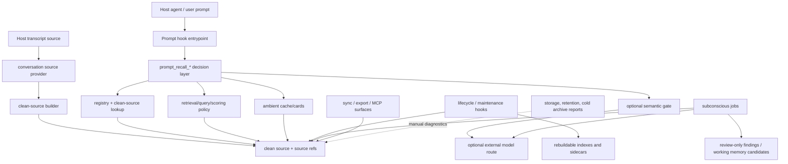

# Runtime Script Map

This is the maintainer navigation map for `skills/aippocampus/scripts/`. It is
not a generated call graph and should not mirror every module docstring. Keep it
focused on ownership, invocation routes, dependencies, and public/internal
status for high-risk scripts and public entrypoints.

When adding a new public entrypoint, hook path, sync path, MCP surface,
registry/retrieval component, warm ambient component, or subconscious job
component, update this map and the cheap guard in
`tools/aippocampus/docs/check_docs_health.py`.

For the exact inventory of remaining Codex-specific raw-rollout/default-home
call sites, see `docs/architecture/provider-entrypoint-inventory.md`.

## High-Level Runtime Flow

This graph is the contributor-facing dependency map. It shows ownership and
call direction at the layer level; it is not a generated import graph.

Core recall is the `Hook -> Decision -> Registry/Retrieval/Semantic/Ambient`
path. Maintenance and storage tools may inspect the same generated artifacts,
but they must not become foreground recall dependencies. If a future deployment
split moves storage, retention, or cold archive work into another process, the
core recall path should still be able to run from registry, clean source, and
its rebuildable lookup sidecars.

## Status Legend

- Public entrypoint: documented or user-facing CLI / hook / MCP command.
- Runtime internal: shipped with the installable skill but called through a
  public entrypoint or scheduler.
- Repo maintenance: shipped script used for diagnostics, storage accounting, or
  operator workflows; not a stable user API.
- Rebuildable cache: may write generated indexes or sidecars, never canonical
  source truth.

## Repo Import Boundary

The installable runtime is still script-first: public and internal runtime code
lives under `skills/aippocampus/scripts/` and must keep direct script invocation
working after the skill is copied into Codex home.

Runtime helpers may move under `skills/aippocampus/scripts/aippocampus_runtime/`
when a narrow ownership boundary is clear. Keep the old top-level script/import
name as a thin compatibility shim until the public stability boundary says it
can be removed.

Current package pilots:

| Package | Top-level compatibility shims | Owner boundary |
|---|---|---|
| `aippocampus_runtime/sync/` | `sync_contract.py` | Shared manifest, transport metadata, and privacy boundary helpers reused by sync routes. |
| `aippocampus_runtime/sync/encrypted/` | `encrypted_sync_bundle.py`, `encrypted_sync_crypto.py`, `encrypted_sync_keys.py`, `encrypted_sync_migration.py`, `encrypted_sync_object_storage.py` | Age-backed encrypted bundle, key, migration, and object-storage helpers. |
| `aippocampus_runtime/warm_ambient/` | `warm_ambient_prompting.py`, `warm_ambient_scout_profiles.py`, `warm_ambient_source_validation.py` | Prompt rendering, scout taxonomy, and source-ref validation for warm ambient recall. |

Repo-owned docs, smoke, and benchmark tools may import runtime helpers through
`tools/aippocampus/repo_paths.py`. The local `_paths.py` files in docs, smoke,
and benchmark folders are compatibility wrappers around that single helper, not
new public APIs. New repo maintenance tools should reuse that helper instead of
adding fresh ad hoc `sys.path` insertion rules.

## Repo Smoke And Readiness Tools

| Tool or group | Purpose | Invocation route | Key dependencies | Status |
|---|---|---|---|---|
| `tools/aippocampus/smoke/smoke_codex_long_session_continuity.py` | Slow/live real Codex app-server long-session smoke for synthetic correction survival across host compaction, plus clean-source rebuild verification. | Manual public-readiness command; not part of the fast deterministic tier. | Codex app-server, `build_clean_source.py`, existing real-host smoke client. | Repo maintenance |
| `tools/aippocampus/smoke/smoke_claude_code_history.py` | Privacy-preserving local Claude Code history parser smoke that reports counts and booleans only. | Manual provider-readiness command; not part of the fast deterministic tier. | `conversation_sources/claude_code.py`; local Claude Code `projects/**/*.jsonl` store. | Repo maintenance |
| `tools/aippocampus/smoke/smoke_cross_agent_continuity.py` | Deterministic synthetic Codex/Claude source-backed retrieval smoke through registry clean source and MCP `search_memory`. | Manual provider-readiness command and fast reviewed sensitive test coverage. | Codex/Claude providers, registry, MCP search. | Repo maintenance |
| `tools/aippocampus/smoke/smoke_question_confirmation_live.py` | Sanitized no-write smoke for optional live question-pair confirmation and tracking round trip. | Manual #134 calibration smoke; dry-run unless `--call-model` is passed. | `question_tracking.py`, `question_confirmation_live.py`, temporary JSONL artifacts only. | Repo maintenance |

## Public Entrypoints And Install Flow

| Script or group | Purpose | Invocation route | Key dependencies | Status |
|---|---|---|---|---|
| `aippocampus_cli.py` | Thin `aippocampus` command facade over documented script entrypoints. | Console script / operator CLI. | Existing script mains via subprocess; preserves child JSON and exit codes. | Public entrypoint |
| `aippocampus_health.py` | Runtime readiness, public smoke checks, and optional derived question stats. | CLI, install docs, CI-adjacent smoke. | `registry.py`, `aippocampuslib.py`, `question_health.py`, filesystem/env checks. | Public entrypoint |
| `aippocampus_maintenance.py` | Compact maintenance wrapper for routine operator checks. | CLI/manual maintenance. | Health, registry, docs/smoke conventions. | Repo maintenance |
| `onboard.py`, `onboard_codex.py`, `onboard_frontier.py`, `onboard_status.py` | Build or report source-backed onboarding state. `onboard.py` is the provider-aware facade; `onboard_codex.py` remains the Codex-only compatibility entrypoint. | CLI and install/readiness workflows. | Clean source, registry, project timeline, optional external model env. | Public entrypoint |
| `export_bundle.py`, `import_bundle.py`, `checkpoint.py` | Move or checkpoint clean-source memory bundles. | CLI/manual export/import. | Registry paths, clean-source manifests, privacy boundaries. | Public entrypoint |
| `append_anchor.py`, `latest_reply.py`, `locate_rollout.py` | Raw rollout audit and recovery helpers. | CLI/debug paths only. | Raw rollout files and thread anchors. | Repo maintenance |

## Conversation Source Providers

Conversation providers are the ingestion boundary between host-agent transcript
storage and AIppocampus clean source. They may know about Codex, Claude Code, or
future hosts, but clean source, registry rows, retrieval, sync, MCP, semantic
sidecars, and subconscious jobs should consume provider-normalized source
identity rather than host-specific storage layouts.

Provider modules must not decide where AIppocampus stores generated artifacts.
Registry storage remains owned by `aippocampus_runtime/registry/store.py` and
`aippocampus_registry_dir()`: `AIPPOCAMPUS_REGISTRY_DIR` and the legacy
`CODEX_HOME/aippocampus-registry` path are storage compatibility concerns, not
conversation-provider homes.

| Script or group | Purpose | Invocation route | Key dependencies | Status |
|---|---|---|---|---|
| `conversation_sources/base.py` | Shared `ConversationProvider`, `ConversationSourceRef`, and provider-normalized visible message shapes. | Imported by registry/onboarding/source builders. | Standard library typing/dataclasses only. | Runtime internal |
| `conversation_sources/codex.py` | Codex Desktop provider for live `sessions/` and `archived_sessions/` rollout JSONL discovery, current-cwd lookup, metadata extraction, and thread identity. | Legacy wrappers in `aippocampuslib.py`, registry scan, current-thread registration. | Codex rollout JSONL first-line `session_meta`; no registry writes. | Runtime internal |
| `conversation_sources/claude_code.py` | Claude Code provider for local `projects/**/*.jsonl` transcript discovery, current-cwd lookup, public metadata extraction, provider-prefixed thread identity, and visible-message clean-source parsing. | `onboard.py --provider claude-code`, registry scan, provider smoke tests. | Claude Code JSONL top-level `sessionId` / `cwd` / `timestamp`; filters thinking/tool payloads from daily clean source. | Runtime internal |
| `conversation_sources/generic_jsonl.py` | Validated generic JSONL import provider for non-Codex/non-Claude hosts. | `onboard.py --provider generic-jsonl`, explicit import/smoke paths. | `AIPPOCAMPUS_GENERIC_IMPORT_DIR` or explicit provider path; rejects ambiguous roles/turns. | Runtime internal |

Claude Code support has a clean-source parser for visible text and explicit
registration. Host MCP setup remains a separate integration surface documented
in `docs/guides/claude-code-mcp.md`. The repository also ships a minimal
project skill at `.claude/skills/aippocampus/SKILL.md` that points Claude Code
at the existing MCP/CLI surfaces; Claude Code hooks and configuration-mutating
installers are not claimed by the provider contract.

## Hook Paths

| Script or group | Purpose | Invocation route | Key dependencies | Status |
|---|---|---|---|---|
| `aippocampus_prompt_hook.py` | Foreground prompt hook that emits skip/scent/evidence under a strict budget. | Opt-in Codex `UserPromptSubmit` hook. | `prompt_recall_*`, `semantic_recall_gate.py`, registry/search modules. | Public entrypoint |
| `aippocampus_lifecycle_hook.py` | Lifecycle hook for deterministic maintenance around Codex session events. | Opt-in Codex lifecycle hook. | Clean source, registry, maintenance helpers. | Public entrypoint |
| `install_aippocampus_prompt_hook.py`, `install_aippocampus_lifecycle_hook.py`, `diagnose_hooks.py` | Install and diagnose hook wiring. | CLI/install docs. | Codex config paths, hook command validation. | Public entrypoint |
| `prompt_cues.py`, `prompt_context_render.py`, `prompt_recall_ambient.py`, `prompt_recall_budget.py`, `prompt_recall_context.py`, `prompt_recall_core.py`, `prompt_recall_decision.py`, `prompt_recall_evidence.py` | Prompt recall policy, budget, rendering, and source-evidence assembly. | Called by prompt hook and smokes. | Registry/search, timeline, semantic cue cache. | Runtime internal |
| `semantic_trigger_router.py`, `semantic_recall_gate.py`, `semantic_cue_cache.py` | Optional semantic gate and cache around foreground recall. | Prompt hook and targeted smokes. | `model_client.py`, external model route metadata, cache files. | Runtime internal |

## Registry, Retrieval, And Indexing

| Script or group | Purpose | Invocation route | Key dependencies | Status |
|---|---|---|---|---|
| `registry.py`, `aippocampus_runtime/registry/{store,search,provider}.py`, and `registry_store.py` / `registry_search.py` / `registry_provider.py` compatibility shims | Resolve registry paths, store thread rows, search registry metadata, and build provider-aware thread keys. | Most runtime entrypoints; `registry.py` remains the public CLI. | Global registry layout and privacy policy. | Runtime internal |
| `build_clean_source.py`, `rollout_behavior_events.py` | Convert provider-normalized transcript messages into source-backed clean messages/turns and structured rollout behavior events. | Onboarding, import, maintenance, tests. | Provider parsers, raw transcript audit, scope-label policy, tool/test event hashing. | Public entrypoint |
| `retrieval.py`, `retrieval_query_policy.py`, `retrieval_score_fusion.py`, `search_clean_source.py`, `search_rollout.py` | Source-backed retrieval, explicit score-fusion policy, and raw audit fallback. | Prompt hook, MCP, CLI search surfaces, future vector/graph fusion consumers. | Clean-source JSONL, registry rows, query policy, stable source ids/source refs; scores remain ranking hints only. | Runtime internal |
| `build_index.py`, `build_segments.py`, `search_segments.py` | SQLite/RAG-lite index and large-thread segment fanout. | Maintenance, query paths, scale smokes. | Clean source, segment manifests, last-known-good publish semantics. | Rebuildable cache |
| `build_project_timeline.py`, `build_semantic_scope_labels.py`, `build_associations.py` | Timeline, semantic sidecars, and source-derived associations. | Onboarding, prompt recall, semantic smokes. | Registry rows, clean source, optional model sidecars. | Rebuildable cache |
| `build_concept_graph.py`, `build_cognitive_map.py`, `question_vector_index.py`, `question_index_sidecar.py` | Advisory graph/map/vector/navigation layers, including optional question-index sidecar evaluation. | Maintenance, research smokes, future question tracking. | Clean-source ids, source-ref fingerprints, source signatures; never truth replacement. | Rebuildable cache |
| `question_confirmation.py` | Borderline question-link confirmation artifact parsing and audit diagnostics. | Imported by `question_tracking.py`; future live calibration. | Pair ids, compact source-backed question payloads; no full-history model input. | Runtime internal |
| `question_confirmation_live.py` | Optional live/model adapter from pending question-pair confirmation requests to explicit confirmation artifacts. | Manual #134 calibration, future scheduler integration; default dry-run unless `--call-model` is passed. | Pending request JSONL, OpenAI-compatible model route, no clean-source messages or full source refs in model payload. | Runtime internal |
| `question_feedback_policy.py` | Source-id-backed dismissal/reopen feedback adapter for question-pair separation pressure. | Imported by `question_tracking.py`; consumes local ambient policy events. | `ambient_recall_policy.jsonl` events with source finding ids; unsourced feedback fails open. | Runtime internal |
| `theme_emergence.py` | Deterministic Phase 3 theme candidates over recurring source-backed question links and concept-graph neighbors. | Imported by deterministic job runner; optional CLI for no-write diagnostics. | `subconscious_jobs.jsonl`, `concept_index.sqlite`, question-link source refs, frontier-marker rows. | Runtime internal |
| `question_health.py` | Derived aggregate question lifecycle and health stats for source-backed subconscious job rows, with explicit local-detail mode. | `aippocampus_health.py --question-stats`, manual diagnostics. | `subconscious_jobs.jsonl`, optional registry clean-source ref resolution. | Repo maintenance |
| `question_resolution.py` | Deterministic explicit user follow-up resolution signal extraction for tracked questions. | Deterministic `subconscious_jobs.py` follow-up after `question_tracking`, plus manual diagnostics; feeds `question_health.py` through append-only `question_resolution_signal` rows. | Registry clean-source user turns, tracked question rows, compact source refs; no raw follow-up text in emitted signals. | Runtime internal |
| `storage_capacity_report.py`, `rollout_size_audit.py`, `retention_report.py`, `cold_archive.py` | Storage, retention, and capacity diagnostics. | Manual readiness / GB-scale work. | Registry and generated-artifact accounting. | Repo maintenance |

These diagnostics are deliberately outside the core recall path. They can read
registry, clean-source manifests, raw rollout audit paths, and generated
sidecars to answer operator questions, but foreground prompt recall should not
import them or wait on them. The user-facing cleanup sequence remains
`retention_report.py --write` before `cold_archive.py`.

## MCP Surface

| Script or group | Purpose | Invocation route | Key dependencies | Status |
|---|---|---|---|---|
| `aippocampus_mcp_server.py` | Read-mostly MCP server for agent clients. | MCP config and plugin install path. | Registry, retrieval/search, public schema boundary. | Public entrypoint |

The MCP server must remain read-mostly unless a future issue explicitly expands
write APIs with privacy review. It should not become the owner of lifecycle,
sync, or retention policy.

## Sync And Vault Projection

This section is the canonical sync responsibility map. Keep README and install
docs focused on commands; put sync ownership changes here instead of mirroring
the contract across multiple docs.

aippocampus_runtime/sync/contract.py owns reusable manifest, transport, and
privacy metadata helpers; `sync_contract.py` remains the compatibility import
shim. `sync_bundle.py` owns the local bundle CLI plus portable registry
locators, clean-source chunk selection, relative-path validation,
managed-directory safety, and conflict-preserving pull behavior. Transport
modules must reuse those contracts rather than inventing their own manifest,
file-selection, path, conflict, or raw-rollout defaults.

| Script or group | Purpose | Invocation route | Key dependencies | Status |
|---|---|---|---|---|
| `aippocampus_runtime/sync/contract.py`, `sync_contract.py`, `sync_bundle.py` | Shared manifest/privacy contract plus local-folder clean-source bundle sync. | CLI/sync docs; `sync_contract.py` is an import compatibility shim. | Content-addressed chunks, path repair, conflict policy. | Public entrypoint |
| `sync_object_storage.py`, `aippocampus_runtime/sync/object_storage/{client,providers}.py`, and `object_storage_*` compatibility shims | HTTP/S3/R2/GCS-compatible object transport. | CLI/sync docs; `sync_object_storage.py` remains the public command. | Shared bundle semantics, provider config, no secret logging. | Public entrypoint |
| `encrypted_sync_admin.py`, `aippocampus_runtime/sync/encrypted/{bundle,object_storage,crypto,keys,migration}.py`, and `encrypted_sync_*` compatibility shims | Age-backed encrypted sync overlay, device-key UX, and plaintext migration helpers. | CLI/encrypted sync docs; `encrypted_sync_admin.py` remains the public command. | Sync bundle/object transport plus key handling. | Public entrypoint |
| `vault_sync_utils.py`, `sync_vault.py`, `vault_notes.py`, `vault_dashboard.py` | Human-readable vault projection and dashboard. | CLI/manual projection. | Clean source and registry rows; not a transport backend. | Public entrypoint |

The local-folder route writes the bundle directly. The object-storage route is
only a PUT/GET adapter over the same bundle. The encrypted route wraps a
temporary plaintext bundle with `age`, refuses mixed plaintext/encrypted roots
or object prefixes, and imports through the same repair/pull semantics after
decryption. `sync_vault.py` is a projection surface, not a third transport
implementation.

Sync code must preserve raw-rollout opt-in, path traversal checks, conflict
preservation, and encrypted-sync requirements. If a future refactor touches
transport or encryption, add tests that prove the shared manifest privacy
boundary still reaches local-folder, object-storage, and encrypted paths.

## Subconscious Jobs And External Models

| Script or group | Purpose | Invocation route | Key dependencies | Status |
|---|---|---|---|---|
| `subconscious_jobs.py`, `subconscious_jobs_config.py`, `subconscious_scheduler.py`, `subconscious_worker.py`, `question_tracking.py`, `question_resolution.py`, `theme_emergence.py`, `journey_tracking.py`, `compensatory_dream.py`, `dream_input_pack.py`, `dream_queue.py`, `dream_sleep_cycle.py`, `dream_precision_policy.py`, `dream_one_sidedness.py`, `dream_retrospective_lifecycle.py`, `coding_rejected_route_probes.py`, `dream_worker.py`, `dream_worker_contract.py`, `dream_real_history_eval.py`, `dream_live_shadow_ab.py`, `dream_delivery_policy.py`, `dream_working_memory.py`, `reflection_space.py` | Schedule and run background semantic/subconscious jobs, including deterministic Phase 2 question-link tracking, deterministic explicit question-resolution signals, deterministic Phase 3 theme candidates, source-backed Journey P1-P3 helpers, Phase 1 compensatory dream candidates, P2 cross-thread dream input packs, deterministic dream queue lifecycle planning, detached sleep-cycle queue execution with no-write defaults, precision policies that keep hard gates separate from soft lifecycle pressure, deterministic one-sidedness gating before opposite-hexagram dream probes, retrospective lifecycle checks for parked future-facing dream probes, coding rejected-route Dream probe fixtures, bounded model-backed compensatory/amplification/prospective dream workers and their stable prompt contract, active-imagination sandbox candidates, selected real-history structural dream eval, opt-in live shadow/delivered A/B reminder-frequency ledger and hook policy plus public clean-source directory negative-control replay, background-adjudicated dream-hypothesis projection to working memory, and reflection-space topology/feedback MVP helpers with collapsed dream-hypothesis nodes. | CLI, scheduler, opt-in maintenance. | Registry, model client, route metadata, job validation, source-backed question candidates with source-derived scope labels, journey waypoints, extraction rows, question links, explicit user follow-up resolution refs, concept-graph neighbors, theme candidate refs, Journey rows, coding decision events, working-memory rows, ambient residue handles, dream input packs, dream queue metadata, dream precision policy components, dream one-sidedness gate rows, dream sleep-cycle lifecycle rows, dream retrospective lifecycle rows, coding rejected-route probe rows, dream candidate refs, adjudicated dream source refs, active-imagination audit gates, retrospective prospective-validation events, benchmark-corpus clean-source rows, shadow/delivered A/B event rows, and reflection feedback rows. | Public entrypoint |
| `subconscious_runtime.py`, `subconscious_agent.py`, `subconscious_tool_loop.py` | Runtime loops and tool execution for background agents. | Scheduler/worker internals. | Job config, external model client, registry outputs. | Runtime internal |
| `subconscious_review.py`, `memory_candidate_router.py`, `subconscious_job_plan.py`, `subconscious_job_validation.py`, `subconscious_job_circuits.py`, `correction_reconsolidation.py`, `coding_decision_events.py`, `coding_ticket_host_contract.py`, `agency_affordance.py` | Review, route, plan, validate, and adjudicate findings before promotion, including correction activation/outcome evidence, coding decision candidates, coding-ticket host consumption simulation, conservative source-backed agency tickets, and backstage-only dream-hypothesis agency safeguards. | Worker, maintenance CLI, and tests. | Working-memory rules, source refs, candidate schemas, privacy-scanned append-only event rows, clean-source message refs, coding continuity host contract fields, dream sensitive-use gates, host-owned permission and sequencing boundaries. | Runtime internal |
| `aippocampus_runtime/model/{client,routing}.py`, plus `model_client.py` and `deepseek_model_routing.py` compatibility shims | External-model request helper and provider route/capability metadata. | Semantic gates and subconscious jobs. | Env config, redaction, provider-specific capability gates. | Runtime internal |
| `semantic_scope_source_review_core.py`, `semantic_scope_suppressed_recovery.py` | Source review and suppressed-label recovery flows. | Smoke/maintenance and optional pro-model jobs. | Clean source, model client, semantic route metadata. | Repo maintenance |

Generated findings, sidecars, and vector neighbors are advisory until they point
back to clean source. External-model features must stay optional.

## Warm Ambient Recall

| Script or group | Purpose | Invocation route | Key dependencies | Status |
|---|---|---|---|---|
| `warm_ambient_recall.py`, `aippocampus_runtime/warm_ambient/`, and `warm_ambient_*` compatibility shims | Multi-scout ambient recall, prompting, profile taxonomy, and validation. | Optional warm recall jobs and smokes. | Registry, clean source, semantic/model routes, privacy filters. | Runtime internal |
| `ambient_warm_scheduler.py`, `ambient_thread_cache.py`, `ambient_recall_policy.py`, `active_recall.py`, `ambient_recall_cards.py` | Scheduling, cache, anti-nag policy overlay, active recall cards, and thread-level ambient state. | Hook/maintenance/warm recall paths. | Prompt hook budget, thread cache, source-backed card rendering, hash-only dismissal/surface events. | Runtime internal |

Warm ambient output should remain quiet and advisory unless a prompt explicitly
needs source-backed evidence. Do not let scout summaries replace clean source.

## Recall Decision Test Map

The recall tests are intentionally split by responsibility rather than gathered
into one giant fixture file. Use this map when changing core recall behavior:

| Surface | Primary tests | What they protect |
|---|---|---|
| Prompt hook glue and budgets | `tests/aippocampus/test_aippocampus_prompt_hook.py`, `tests/aippocampus/test_prompt_recall_decision_boundaries.py` | Hook output shape, quiet/default behavior, budget boundaries, ambient attach rules, and decision-module ownership. |
| Deterministic cue and semantic gate | `tests/aippocampus/test_semantic_recall_gate.py`, `tests/aippocampus/test_semantic_trigger_router.py`, `tests/aippocampus/test_semantic_cue_cache.py` | Vague-continuation gating, semantic trigger review, cache behavior, and unavailable-model diagnostics. |
| Source-backed retrieval | `tests/aippocampus/test_search_clean_source.py`, `tests/aippocampus/test_retrieval_query_policy.py`, `tests/aippocampus/test_retrieval_score_fusion.py` | Query expansion, scoring hints, clean-source search, and source-ref-preserving result ranking. |
| Warm ambient recall | `tests/aippocampus/test_warm_ambient_recall.py`, `tests/aippocampus/test_benchmark_warm_ambient_recall.py`, `tests/aippocampus/test_benchmark_warm_ambient_sweep.py` | Scout merge behavior, source validation, privacy guards, cache write policy, and benchmark payload contracts. |
| Architecture and coupling guardrails | `tests/aippocampus/test_import_coupling.py`, `tests/aippocampus/test_architecture_boundaries.py` | Import boundaries, hook/core separation, large-script debt registration, and high-risk mypy coverage. |

For ordinary documentation-only changes, the fast deterministic command remains
`python tools/aippocampus/run_tests.py --tier fast`. For targeted recall-policy
work, run the relevant tests above in addition to the tier command when the
change touches that surface.

## Maintenance Rule

This map intentionally groups low-level helpers. Do not add every helper merely
because it exists. Do update it when a script becomes a public entrypoint,
creates or mutates generated artifacts, calls external models, handles sync or
encryption, participates in hooks/MCP, or owns a durable source boundary.
