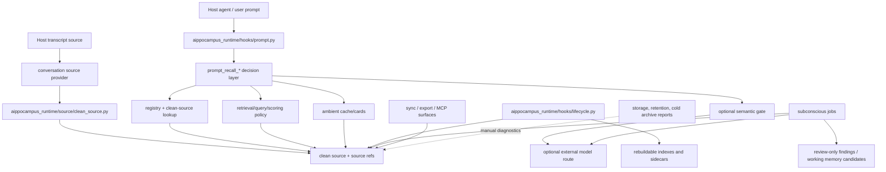

# Runtime Entry Map

Role: implementation map.

This is the maintainer navigation map for `skills/aippocampus/scripts/`.
Runtime ownership now lives in package modules under
`aippocampus_runtime/` and `conversation_sources/`. The public human-facing
command is the packaged `aippocampus` console facade; repo and installed-skill
smokes may also use `python -m <package.module>` with the skill `scripts/`
directory on `PYTHONPATH`.

There should be no flat `skills/aippocampus/scripts/*.py` compatibility
entrypoints. The shim inventory is now a residual-debt audit:

```powershell
python tools\aippocampus\docs\compat_shim_inventory.py --json
```

For the exact inventory of remaining Codex-specific raw-rollout/default-home
call sites, see `docs/architecture/provider-entrypoint-inventory.md`.

## High-Level Runtime Flow

This graph is the contributor-facing dependency map. It shows ownership and
call direction at the layer level; it is not a generated import graph.



Core recall is the `Hook -> Decision -> Registry/Retrieval/Semantic/Ambient`
path. Maintenance and storage tools are outside the core recall path. They may
inspect the same generated artifacts, but they must not become foreground recall
dependencies. If a future deployment split moves storage, retention, or cold
archive work into another process, the core recall path should still be able to
run from registry, clean source, and its rebuildable lookup sidecars.

## Runtime Boundary

- Public command facade: `aippocampus_runtime/cli/facade.py`.
- Prompt/lifecycle hooks: install commands write module invocations, not flat
  script paths.
- Codex-only hook installer boundary: hook installers mutate Codex `hooks.json`
  only after an explicit operator command; provider support for Claude Code or
  generic JSONL does not imply host hook installation support.
- MCP server: `aippocampus_runtime/mcp/server.py`.
- Source truth: raw host transcripts and clean-source JSONL remain the only
  truth sources. Summaries, labels, scores, graphs, and dream/subconscious rows
  are navigation or review layers until they reopen clean source.
- Rebuildable caches: index, segments, Graphify corpus, cognitive maps, and
  derived sidecars may be deleted and rebuilt.
- Repo maintenance tools live under `tools/aippocampus/`; they can import
  package owners through `tools/aippocampus/repo_paths.py`.

## Protocol-First Ports

`ConversationProvider` is the only current protocol-first port with real replacement pressure:
Codex, Claude Code, and generic JSONL sources share the same source ids/source refs
boundary. Do not introduce a port just because a helper has more than one caller.
AIppocampus is not a tagless-final architecture; package modules should stay
concrete until another host, transport, or storage implementation needs the same
behavior behind a stable contract.

## Owner Map

| Runtime entry | Purpose | Status |
|---|---|---|
| `aippocampus_runtime/cli/facade.py` | Public `aippocampus` command facade over package-owner mains. | Public entrypoint |
| `aippocampus_runtime/hooks/prompt.py` | Foreground Codex prompt hook with strict budget, skip/scent/evidence output, and fail-open diagnostics. | Public entrypoint |
| `aippocampus_runtime/hooks/lifecycle.py` | Codex lifecycle hook for deterministic maintenance and detached background scheduling. | Public entrypoint |
| `aippocampus_runtime/hooks/install_prompt.py`, `aippocampus_runtime/hooks/install_lifecycle.py`, `aippocampus_runtime/hooks/diagnose.py` | Codex-only hook install/status/uninstall and stale-hook diagnostics. | Public entrypoint |
| `aippocampus_runtime/mcp/server.py` | Read-mostly MCP server for search, recall navigation, latest-reply, health, and sync status. | Public entrypoint |
| `aippocampus_runtime/health.py` | Runtime health report and recommended rebuild actions. | Public entrypoint |
| `aippocampus_runtime/registry/api.py`, `aippocampus_runtime/registry/store.py`, `aippocampus_runtime/registry/search.py`, `aippocampus_runtime/registry/provider.py` | Registry path resolution, thread registration, metadata search, and provider-aware thread keys. | Runtime internal |
| `aippocampus_runtime/source/clean_source.py` | Provider-normalized clean-source builder. | Public entrypoint |
| `aippocampus_runtime/source/search.py` | Direct clean-source JSONL search. | Public entrypoint |
| `aippocampus_runtime/source/latest_reply.py`, `aippocampus_runtime/source/locate_rollout.py`, `aippocampus_runtime/source/anchors.py` | Raw-audit helpers and thread anchor utilities. | Repo maintenance |
| `aippocampus_runtime/source/semantic_scope_builder.py`, `aippocampus_runtime/source/semantic_scope_labels.py`, `aippocampus_runtime/source/semantic_scope_evidence_diagnostics.py`, `aippocampus_runtime/source/semantic_scope_source_review_core.py`, `aippocampus_runtime/source/semantic_scope_suppressed_recovery.py`, `aippocampus_runtime/source/source_texture.py`, `aippocampus_runtime/source/texture_consumption.py`, `aippocampus_runtime/source/agent_self_notes.py` | Semantic sidecar materialization, validation, public-safe evidence diagnostics, source review, suppressed-label recovery, deterministic source-texture rows, shared sanitized consumer projection for Dream/Journey/correction routing, and private low-authority foreground-agent self-note sidecars. | Runtime internal |
| `aippocampus_runtime/ops/log_retention.py` | Public `aippocampus logs status/rotate` owner plus the bounded writer used by hook/background logs. Reports names and byte counts, not log contents. | Public entrypoint |
| `aippocampus_runtime/ops/route_readiness.py`, `aippocampus_runtime/ops/cognitive_observatory.py` | Public-safe, no-write route-readiness and Cognitive Observatory readouts. Route rows are navigation-only diagnostics with TTL/freshness/privacy/ROI suppression reasons; the observatory aggregates route readiness, activation authority, recall diagnostics, and sleep-cycle summaries, and can render the sanitized report as static no-script HTML without becoming a control plane. | Public entrypoint |
| `aippocampus_runtime/ops/activation_payload_compaction.py` | Explicit dead-letter manifest runner for owner-specific activation payload compaction across ambient cache, working memory, semantic triggers, and active recall locks; dry-run by default, `--apply` required for writes. | Repo maintenance |
| `aippocampus_runtime/recall/index_builder.py` | SQLite/RAG-lite index builder over clean source. | Rebuildable cache |
| `aippocampus_runtime/recall/segment_builder.py`, `aippocampus_runtime/recall/segment_search.py` | Large-thread segment fanout and segment search. | Rebuildable cache |
| `aippocampus_runtime/recall/retrieval.py`, `aippocampus_runtime/recall/query_policy.py`, `aippocampus_runtime/recall/scoring_policy.py`, `aippocampus_runtime/recall/score_fusion.py`, `aippocampus_runtime/recall/cognitive_load_sidecar.py` | Source-backed retrieval, query policy, named scoring policies, score fusion, and bounded cognitive-load routing hints. | Runtime internal |
| `aippocampus_runtime/recall/semantic_recall_gate.py`, `aippocampus_runtime/recall/semantic_trigger_router.py`, `aippocampus_runtime/recall/semantic_cue_cache.py`, `aippocampus_runtime/recall/semantic_result_cache.py` | Optional semantic gate and semantic-cache/trigger routing. | Runtime internal |
| `aippocampus_runtime/recall/active_recall.py`, `aippocampus_runtime/recall/active_recall_lock.py`, `aippocampus_runtime/recall/active_recall_lock_compaction.py`, `aippocampus_runtime/recall/active_path_packet.py`, `aippocampus_runtime/recall/route_notes.py`, `aippocampus_runtime/recall/ambient_cards.py`, `aippocampus_runtime/recall/ambient_cache.py`, `aippocampus_runtime/recall/ambient_cache_compaction.py`, `aippocampus_runtime/recall/ambient_policy.py` | Foreground active-recall, active-path orientation packet, route-note sidecar projection, and ambient-card state, plus active-lock and ambient-cache dead-letter compaction as maintenance apply work. | Runtime internal |
| `aippocampus_runtime/navigation/project_timeline.py`, `aippocampus_runtime/navigation/associations.py`, `aippocampus_runtime/navigation/concept_graph.py`, `aippocampus_runtime/navigation/cognitive_map.py`, `aippocampus_runtime/navigation/repo_familiarity.py` | Timeline, associations, concept/cognitive maps, and repo familiarity navigation. | Rebuildable cache |
| `aippocampus_runtime/question/confirmation_live.py`, `aippocampus_runtime/question/index_sidecar.py`, `aippocampus_runtime/question/health.py`, `aippocampus_runtime/question/tracking.py` | Question confirmation, sidecar indexing, health stats, and deterministic question tracking. | Runtime internal |
| `aippocampus_runtime/subconscious/jobs.py`, `aippocampus_runtime/subconscious/jobs_config.py`, `aippocampus_runtime/subconscious/runtime.py`, `aippocampus_runtime/subconscious/scheduler.py`, `aippocampus_runtime/subconscious/time_maintenance.py`, `aippocampus_runtime/subconscious/agent_fallback_executor.py`, `aippocampus_runtime/subconscious/agent_fallback_materializer.py`, `aippocampus_runtime/subconscious/worker.py`, `aippocampus_runtime/subconscious/review.py` | Background job orchestration, detached scheduling, opt-in time-due maintenance candidate planning, no-key agent-fallback result production/materialization, worker loop, and finding review. | Runtime internal |
| `aippocampus_runtime/subconscious/candidate_router.py`, `aippocampus_runtime/subconscious/question_resolution.py`, `aippocampus_runtime/subconscious/theme_emergence.py` | Candidate routing, explicit follow-up resolution, and deterministic theme candidates. | Runtime internal |
| `aippocampus_runtime/dream/compensatory.py`, `aippocampus_runtime/dream/one_sidedness.py`, `aippocampus_runtime/dream/precision_policy.py`, `aippocampus_runtime/dream/retrospective_lifecycle.py`, `aippocampus_runtime/dream/sleep_cycle.py`, `aippocampus_runtime/dream/worker.py` | Dream candidate planning, gates, queue lifecycle, detached sleep cycle, and bounded workers. | Runtime internal |
| `aippocampus_runtime/reflection/space.py`, `aippocampus_runtime/reflection/reconsolidation.py` | Reflection-space topology and correction reconsolidation. | Runtime internal |
| `aippocampus_runtime/journey/tracking.py` | Journey Tracking dataclasses and waypoint lifecycle. | Runtime internal |
| `aippocampus_runtime/coding/agency_affordance.py`, `aippocampus_runtime/coding/code_state_anchors.py`, `aippocampus_runtime/coding/decision_events.py`, `aippocampus_runtime/coding/episode_arcs.py`, `aippocampus_runtime/coding/host_contract.py`, `aippocampus_runtime/coding/rejected_route_probes.py`, `aippocampus_runtime/coding/sequence_packets.py` | Coding continuity events, checkout/PR/diff/check state anchors, Episode/Arc read-models and source-window reopen plans, host contract simulation, agency tickets, rejected-route probes, and ordered sequence/load read-model validation. | Runtime internal |
| `aippocampus_runtime/model/client.py`, `aippocampus_runtime/model/routing.py`, `aippocampus_runtime/model/multimodal_routing.py`, `aippocampus_runtime/model/multimodal_answer_gate.py` | Optional external-model client, route metadata, multimodal routing, and answer-time source-reopen gates. | Runtime internal |
| `aippocampus_runtime/sync/bundle.py`, `aippocampus_runtime/sync/contract.py` | Local-folder bundle sync and shared manifest/privacy contract. | Public entrypoint |
| `aippocampus_runtime/sync/object_storage/cli.py`, `aippocampus_runtime/sync/object_storage/client.py`, `aippocampus_runtime/sync/object_storage/providers.py` | HTTP/S3/R2/GCS-compatible object transport over the same bundle semantics. | Public entrypoint |
| `aippocampus_runtime/sync/encrypted/bundle.py`, `aippocampus_runtime/sync/encrypted/head_graph.py`, `aippocampus_runtime/sync/encrypted/admin.py`, `aippocampus_runtime/sync/encrypted/keys.py`, `aippocampus_runtime/sync/encrypted/key_providers.py`, `aippocampus_runtime/sync/encrypted/recovery_diagnostics.py`, `aippocampus_runtime/sync/encrypted/migration.py`, `aippocampus_runtime/sync/encrypted/migration_recipients.py`, `aippocampus_runtime/sync/encrypted/migration_recovery.py`, `aippocampus_runtime/sync/encrypted/object_storage.py` | Age-backed encrypted sync overlay, key-provider/recovery diagnostics, and plaintext migration helpers. | Public entrypoint |
| `aippocampus_runtime/vault/sync.py` | Human-readable vault projection. | Public entrypoint |
| `aippocampus_runtime/warm_ambient/cli.py`, `aippocampus_runtime/warm_ambient/config.py`, `aippocampus_runtime/warm_ambient/prewarm_planner.py`, `aippocampus_runtime/warm_ambient/recall.py`, `aippocampus_runtime/warm_ambient/scheduler.py`, `aippocampus_runtime/warm_ambient/prompting.py`, `aippocampus_runtime/warm_ambient/scout_profiles.py`, `aippocampus_runtime/warm_ambient/scout_attribution.py`, `aippocampus_runtime/warm_ambient/source_validation.py`, `aippocampus_runtime/warm_ambient/diagnostics.py` | Warm ambient recall, no-write prewarm planning, config, detached scheduling, scout taxonomy, attribution, and source validation. | Runtime internal |

## Sync And Vault Projection

This section is the canonical sync responsibility map. Keep README and install
docs focused on commands; put sync ownership changes here instead of mirroring
the contract across multiple docs.

The local-folder route writes the bundle directly. The object-storage route is
only a PUT/GET adapter over the same bundle. The encrypted route wraps a
temporary plaintext bundle with `age`, refuses mixed plaintext/encrypted roots
or object prefixes, and imports through the same repair/pull semantics after
decryption. It also records age-only head graph diagnostics and preserves
divergent encrypted heads under `.sync-conflicts/encrypted-heads/` for manual
review; that surface is not sender authentication or automatic multi-writer
merge. Vault sync is a projection surface, not a third transport implementation.

Sync code must preserve raw-rollout opt-in, path traversal checks, conflict
preservation, and encrypted-sync requirements. If a future refactor touches
transport or encryption, add tests that prove the shared manifest privacy
boundary still reaches local-folder, object-storage, and encrypted paths.

## Subconscious Jobs And External Models

Generated findings, sidecars, and vector neighbors are advisory until they
point back to clean source. External-model features must stay optional.

DeepSeek routes use the shared model route contract before any background
worker calls a model: default `thinking="enabled"`, default
`reasoning_effort="high"`, DeepSeek prefix-cache telemetry, and no sampling
temperature when thinking mode is active. Warm ambient, Dream model-backed
workers, detached sleep-cycle runs, and older subconscious workers all consume
that route contract rather than hard-coding per-call values. Conservative
OpenAI-compatible routes omit DeepSeek-only fields unless the configured route
explicitly advertises the matching capability. Returned `reasoning_content` is
not memory source material: current AIppocampus routes strip it with
count-level diagnostics, and provider tool-call continuation remains
unsupported until a future replay contract can preserve it without storing
chain-of-thought in clean source, staging, caches, or public reports.

## Recall Decision Test Map

The recall tests are intentionally split by responsibility rather than gathered
into one giant fixture file. Use this map when changing core recall behavior:

| Surface | Primary tests | What they protect |
|---|---|---|
| Prompt hook glue and budgets | `tests/aippocampus/test_aippocampus_prompt_hook.py`, `tests/aippocampus/test_prompt_recall_decision_boundaries.py` | Hook output shape, quiet/default behavior, budget boundaries, ambient attach rules, and decision-module ownership. |
| Fresh-thread agent policy | `tests/aippocampus/test_fresh_thread_scent_packet.py`, `tests/aippocampus/test_fresh_thread_activation_state.py`, `tests/aippocampus/test_fresh_thread_action_policy.py`, `tests/aippocampus/test_fresh_thread_demo.py`, `tests/aippocampus/test_benchmark_fresh_thread_recall_demo.py`, `tests/aippocampus/test_fresh_thread_real_history_smoke.py` | Packet privacy shape, progressive activation state transitions, agent-owned decisions to ignore/use silently/ask/active-recall/source-reopen, source reopen before specific memory claims, public-safe demo coverage, and sanitized real-history boundary smoke coverage. |
| Active path orientation | `tests/aippocampus/test_active_path_packet.py` | Compact task-start path selection across existing recall/navigation surfaces, source-joined route notes, route separation for scent/reopen/evidence/ignore, stale-boundary visibility, and ids-only source refs. |
| Activation-surface authority | `tests/aippocampus/test_activation_surface_authority.py` | No-write authority audit for AAR nudges, dream hypotheses, semantic triggers, ambient cards, active recall locks, pruning rows, freshness decay, candidate validation annotations, dead-letter inactivity, explicit user corrections, and current/source evidence conflicts. |
| Deterministic cue and semantic gate | `tests/aippocampus/test_semantic_recall_gate.py`, `tests/aippocampus/test_semantic_trigger_router.py`, `tests/aippocampus/test_semantic_cue_cache.py`, `tests/aippocampus/test_living_cue_cache.py` | Vague-continuation gating, semantic trigger review, semantic/living cue-cache behavior, unavailable-model diagnostics, source-handle bridge packets, and temporary/stale over-personalization suppression. |
| Source-backed retrieval and prompt gates | `tests/aippocampus/test_search_clean_source.py`, `tests/aippocampus/test_retrieval_query_policy.py`, `tests/aippocampus/test_retrieval_score_fusion.py`, `tests/aippocampus/test_recall_scoring_policy.py`, `tests/aippocampus/test_prompt_recall_policy.py`, `tests/aippocampus/test_cognitive_load_sidecar.py` | Query expansion, named retrieval scoring policies, named foreground skip/scent/evidence gate policies, clean-source search, source-ref-preserving result ranking, and bounded cognitive-load routing hints. |
| Warm ambient recall | `tests/aippocampus/test_warm_ambient_recall.py`, `tests/aippocampus/test_prewarm_planner.py`, `tests/aippocampus/test_benchmark_warm_ambient_recall.py`, `tests/aippocampus/test_benchmark_warm_ambient_sweep.py` | Scout merge behavior, no-write prewarm planning, source validation, privacy guards, cache write policy, and benchmark payload contracts. |
| Architecture and coupling guardrails | `tests/aippocampus/test_import_coupling.py`, `tests/aippocampus/test_architecture_boundaries.py`, `tests/aippocampus/test_compat_shim_inventory.py` | Import boundaries, no flat runtime scripts, large-module debt registration, and high-risk mypy coverage. |

For ordinary documentation-only changes, the small inner-loop command is
`python tools/aippocampus/run_tests.py --tier quick`; the broad deterministic PR
lane is `python tools/aippocampus/run_tests.py --tier pr`. For targeted
recall-policy work, run the relevant tests above in addition to the tier command
when the change touches that surface.

## Maintenance Rule

This map intentionally groups low-level helpers. Do not add every helper merely
because it exists. Do update it when a module becomes a public entrypoint,
creates or mutates generated artifacts, calls external models, handles sync or
encryption, participates in hooks/MCP, or owns a durable source boundary.
