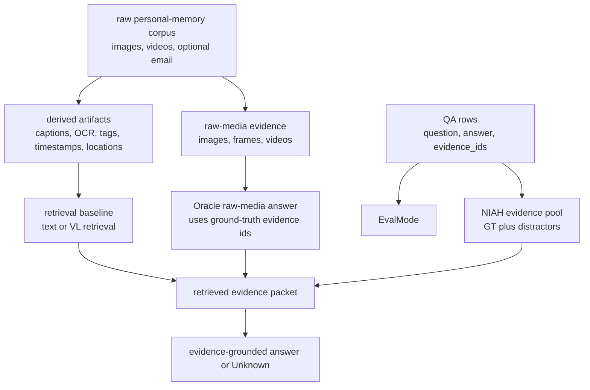

# ATM-Bench Hard Protocol Boundary

Status: verified external-benchmark intake for GitHub #530 and the #528
multimodal source-backed recall track.

Verified upstream sources on 2026-06-03:

- [ATM-Bench data layout and schemas](https://github.com/JingbiaoMei/ATM-Bench/blob/main/docs/data.md)
- [ATM-Bench baseline protocol](https://github.com/JingbiaoMei/ATM-Bench/blob/main/docs/baseline.md)
- [ATM-Bench NIAH protocol](https://github.com/JingbiaoMei/ATM-Bench/blob/main/docs/niah.md)
- [ATM-Bench agent runner guide](https://github.com/JingbiaoMei/ATM-Bench/blob/main/agent_systems/RUNNER_GUIDE.md)

## Core Interpretation

ATM-Bench Hard is best treated as a staged personal-memory-corpus QA benchmark.
It is not primarily a conversational upload-history benchmark where a user
first sends images inside a chat and later asks the agent to recall that same
conversation trace.

Upstream expects benchmark files and raw memory artifacts under local `data/`.
The documented layout includes QA JSON files, raw images/videos, optional email
JSON, generated `batch_results.json` artifacts, and NIAH pool files. The QA rows
carry `id`, `question`, `answer`, and ground-truth `evidence_ids`; NIAH rows add
`niah_evidence_ids` as a fixed evidence pool that contains the ground truth.

The baseline docs frame ATM-Bench as evidence-grounded answering: models should
answer only from provided/retrieved evidence and return `Unknown` when evidence
is insufficient. They also separate text-only `batch_results` mode, where
images/videos are represented through captions/OCR/tags, from raw-media mode,
where raw images/videos are inserted into the prompt for multimodal inference.

## Protocol Shape

This pipeline gives AIppocampus useful pressure tests, but the adaptation must
keep the layers separate:

- Corpus setup and media extraction test source registration and derived
  artifact policy.
- Retrieval baselines test whether the right evidence can be found and
  reopened.
- Oracle tests answer synthesis with perfect retrieval.
- NIAH tests answer synthesis/reasoning over a fixed evidence pool containing
  ground truth plus distractors.
- Agent-system mode tests an isolated agent tool run with question plus memory
  directory, while ground truth files stay hidden.

## What ATM-Bench Does Not Prove For AIppocampus

Do not use ATM-Bench Hard as proof of:

- AIppocampus product privacy behavior for local photo libraries, disks, cloud
  drives, calendars, or email boxes;
- conversational media-ingest recall where the user's own wording around an
  uploaded/selected image is itself source;
- background scanning consent semantics;
- source-backed life-wide continuity across arbitrary private histories;
- AIppocampus multimodal benchmark scores, until a real adapter and dated run
  exist.

The upstream harness stages a curated evaluation corpus. AIppocampus must keep
its own origin policy: user-provided media, onboarded libraries, and background
filesystem media are different trust situations.

## AIppocampus Adaptation Slices

### Corpus-Style Multimodal Retrieval

Owned by #531.

Use this slice when evaluating whether AIppocampus can register a public-safe
multimodal source corpus, create anchored derived artifacts, retrieve evidence
through multiple channels, reopen original source anchors, and answer or abstain
with source boundaries.

This is the closest ATM-Bench adaptation. It should preserve the distinction
between derived text candidates and raw media source authority.

### Conversational Media-Ingest Recall

Owned by #532.

Use this slice when the user explicitly uploaded, dragged in, or selected media
inside a conversation. The user's wording, the selected media, and the
assistant's response are all part of the source history. This is not the same as
ATM-Bench staged-corpus QA, because the conversation trace itself can carry
labels, intent, or ambiguity that later recall must reopen.

The public-safe deterministic contract smoke is documented in
[`../reports/multimodal/conversational-media-ingest-fixture-report.md`](../reports/multimodal/conversational-media-ingest-fixture-report.md).

### Oracle-Style Answer Synthesis

Use this slice when retrieval is intentionally removed from the measurement.
The evidence ids are already known, so the question is whether the answerer can
use reopened evidence without guessing, picking stale/weaker sources, or
overriding source conflicts.

Do not report Oracle performance as retrieval quality.

### NIAH-Style Evidence-Pool Evaluation

Owned by #533.

Use this slice when a fixed evidence pool contains all needed evidence plus
distractors. This decouples retrieval from answer synthesis and lets pool size
control distractor pressure.

For AIppocampus, NIAH-style fixtures should score whether the answerer selects
the right source anchors, handles conflict/recency, and abstains when the
question asks for unsupported details.

The public-safe deterministic contract smoke for #533 is documented in
[`../reports/multimodal/multimodal-niah-evidence-pool-report.md`](../reports/multimodal/multimodal-niah-evidence-pool-report.md).

### Benchmark-Map Context

Owned by #534.

ATM-Bench is one source-shape reference, not the canonical yardstick for all
multimodal memory. HippoCamp, MemLens, EgoMemReason/MyEgo/Ego4D, UniDoc-Bench,
and other benchmarks pressure different source shapes. Borrow the failure mode,
not the whole benchmark as a product claim.

## Claim Boundaries For Future Docs

Future #528 docs and runners should use this wording:

- "ATM-Bench-inspired corpus-style fixture" when the input is a staged
  multimodal memory corpus.
- "Conversational media-ingest fixture" when the media was sent or selected in
  a user conversation and the conversation trace itself is evidence.
- "Oracle-style answer synthesis" when ground-truth evidence ids are supplied.
- "NIAH-style evidence-pool evaluation" when the pool contains ground truth plus
  distractors.

Avoid these phrases unless the corresponding adapter and evidence exist:

- "AIppocampus supports ATM-Bench Hard."
- "ATM-Bench proves AIppocampus multimodal memory quality."
- "ATM-Bench privacy model."
- "Raw captions/OCR/tags are source truth."
- "Conversational upload recall is covered by staged-corpus QA."

## Acceptance Boundary

This note closes the protocol-boundary slice only. It does not implement a
benchmark runner, import upstream data, create public-safe media fixtures, or
claim any AIppocampus score.
